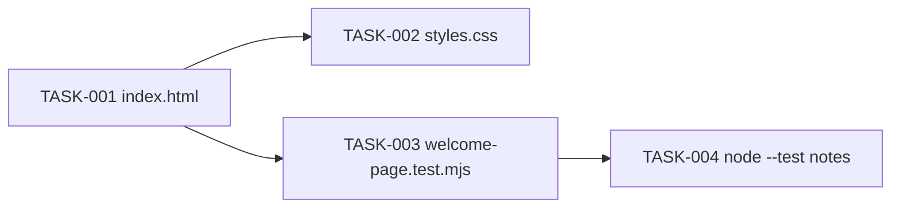

# Implementation Plan: Hari-Agents welcome page

## Document status

- Status: Complete
- Source architecture: `plans/hari-agents/architecture.md` (Approved, 2026-10-05)
- Design review: Passed
- Ready for implementation: Yes
- Planning date: 2026-10-05
- Implementation date: 2026-10-05
- Production coding: Complete (TASK-001 through TASK-004)

### Allowed status values

| Status | Meaning |
|--------|---------|
| Draft | Plan is incomplete or awaiting architecture approval. |
| Ready for Implementation | Tasks are dependency-ordered and unblocked enough for the implementation agent. |
| In Progress | Implementation of one or more tasks has started. |
| Blocked | A missing decision or failed predecessor prevents safe progress. |
| Complete | All tasks meet their Definition of Done. |

This document is **Complete**. TASK-001 through TASK-004 are implemented. `index.html`, `styles.css`, and `welcome-page.test.mjs` exist under `plans/hari-agents/`. A reviewer copy of approved FRs/ACs is in `requirements.md` in the same folder (does not replace repo-root `US-LOGO-1` `requirements.md`).

---

## 1. Scope

Deliver one static welcome page under `plans/hari-agents/`:

| Item | Exact value |
|------|-------------|
| Document title | `Hari-Agents` |
| Visible heading (`h1`) | `Hari-Agents` |
| Greeting | `Welcome to Hari-Agents` |
| Tagline | `A personal agent workspace.` |
| Canvas / text | `#ffffff` / `#1a1a1a` |
| Stack | Plain HTML + CSS; no SPA, no npm, no page JavaScript, no remote URLs |
| Verification | `welcome-page.test.mjs` via `node --test` (zero extra dependencies) |

Original request: create welcome page "Hari-Agents".

### 1.1 In scope

- `index.html` semantic structure per architecture §7.1
- `styles.css` layout, contrast, and responsive wrapping per C-STYLE
- `welcome-page.test.mjs` string assertions per architecture §7.2
- Run `node --test` and record results in §6 of this plan

### 1.2 Out of scope (do not implement)

Auth, APIs, analytics, in-page Jira, multi-page navigation, agent execution, SPA/frameworks, npm, page `<script>`, remote assets, `US-LOGO-1` logo/PWA/favicon, decorative images, theme toggle, backend, or files outside `plans/hari-agents/`.

---

## 2. Constraints for the implementation agent

1. Write only the three delivery files listed below, plus notes in this plan after TASK-004.
2. Do not add `package.json`, `node_modules`, build scripts, or inline `<style>` as a substitute for `styles.css`.
3. Do not put `<script>` in `index.html` (inline or `src`). Do not link `welcome-page.test.mjs` from the page.
4. The only stylesheet link is same-folder `href="styles.css"`. No remote `href`, `src`, or `@import`.
5. Do not place page files at the Cursor repo root or in a new root `hari-agents/` folder (gitignored).
6. Do not link `architecture.md` or `impl-plan.md` from `index.html`.
7. Visual/NFR checks (contrast, ~1280×800 first viewport, ~375×667 wrap) are human checks; C-TEST does not prove them.

---

## 3. Delivery files

```text
plans/hari-agents/
  architecture.md              # existing, Approved — do not rewrite
  impl-plan.md                 # this document
  requirements.md              # reviewer copy of approved FRs/ACs (Hari-Agents only)
  index.html                   # TASK-001
  styles.css                   # TASK-002
  welcome-page.test.mjs        # TASK-003
```

---

## 4. Task list

Execution order: TASK-001 → TASK-002 → TASK-003 → TASK-004.

All four tasks are **Ready**. Architecture contracts are complete, so none are Blocked. TASK-002 and TASK-003 depend on TASK-001 existing on disk before they can be validated, but they may be authored immediately from the approved HTML contract.

---

### TASK-001: `index.html` semantic structure

| Field | Value |
|-------|--------|
| ID | TASK-001 |
| Priority | P0 |
| Status | Complete |
| Depends on | None |
| Blocks | TASK-002 (validation), TASK-003 (file under test), TASK-004 |
| Component | C-PAGE |
| Files | `plans/hari-agents/index.html` (create) |

**Work**

Create a single HTML5 document that satisfies architecture §7.1:

- `<html lang="en">`
- `<meta charset="utf-8">`
- `<meta name="viewport" content="width=device-width, initial-scale=1">`
- `<title>Hari-Agents</title>` exactly
- `<link rel="stylesheet" href="styles.css">` (relative, same folder; only linked resource)
- exactly one `<h1>Hari-Agents</h1>`
- greeting text exactly `Welcome to Hari-Agents`
- branding line exactly `A personal agent workspace.` (period included, matching architecture default)
- one `<main>` wrapping heading, greeting, and branding line
- no `<form>`
- no `<script>`
- no remote `href` / `src`

Suggested inner structure (implementer may adjust element types except `main` / `h1`):

```html
<main>
  <h1>Hari-Agents</h1>
  <p>Welcome to Hari-Agents</p>
  <p>A personal agent workspace.</p>
</main>
```

**Validation**

- File exists at `plans/hari-agents/index.html`.
- Source contains the exact title, `h1`, greeting, tagline, viewport meta, `lang="en"`, charset, and same-folder CSS link.
- Source contains no `<form>`, no `<script>`, and no `http://` or `https://` URLs.

**Definition of Done**

- [x] HTML contract §7.1 is met with exact copy for title, `h1`, greeting, and tagline.
- [x] Single `main` landmark; single `h1`.
- [x] No forms, scripts, or remote URLs.
- [x] Page remains readable as unstyled HTML if CSS is missing (FR-12).

---

### TASK-002: `styles.css` layout / contrast / responsive

| Field | Value |
|-------|--------|
| ID | TASK-002 |
| Priority | P0 |
| Status | Complete |
| Depends on | TASK-001 (styles a real document; CSS file may be drafted from the contract) |
| Blocks | Visual portion of TASK-004 notes (optional) |
| Component | C-STYLE |
| Files | `plans/hari-agents/styles.css` (create) |

**Work**

Create a same-folder stylesheet that:

- Sets canvas background `#ffffff` and primary text `#1a1a1a` (AD-12).
- Uses a system UI font stack only (no webfonts, no CDN, no `@import`).
- Composes heading, greeting, and tagline in the first viewport on ~1280×800 (centered or clearly first-screen; no click required).
- Uses fluid width; heading and greeting wrap without horizontal clipping at ~375×667.
- Does not hide the `h1` or identity text (FR-12).
- Does not add a theme toggle, dark-mode switch, or decorative required images.

**Validation**

- File exists at `plans/hari-agents/styles.css`.
- Tokens `#ffffff` and `#1a1a1a` appear as the page background and text colors.
- No `@import`, no `url(http`, no `url(https`.
- Implementer opens `index.html` via `file://` and confirms first-viewport content on a typical desktop width and wrapping at a ~375-wide viewport (browser DevTools is sufficient).

**Definition of Done**

- [x] Light readable theme uses the approved tokens.
- [x] System fonts only; no remote assets.
- [x] First-viewport composition on ~1280×800.
- [x] No clip of heading/greeting at ~375×667.
- [x] Contrast remains a known WCAG 2.2 pass for normal text (white / near-black).

---

### TASK-003: `welcome-page.test.mjs` string assertions

| Field | Value |
|-------|--------|
| ID | TASK-003 |
| Priority | P0 |
| Status | Complete |
| Depends on | TASK-001 (reads `index.html` as text) |
| Blocks | TASK-004 |
| Component | C-TEST |
| Files | `plans/hari-agents/welcome-page.test.mjs` (create) |

**Work**

Create a zero-dependency ESM test using `node:test`, `node:assert`, and `fs.readFileSync` on `index.html` in the same folder. Do not launch a browser. Do not add npm packages.

Assert at least:

- `<title>Hari-Agents</title>` (exact)
- exactly one `<h1>` whose text is `Hari-Agents`
- greeting contains `Welcome` and `Hari-Agents` (exact sentence `Welcome to Hari-Agents` is preferred)
- viewport meta includes `width=device-width`
- no `<form>`
- no `<script>`
- no analytics markers (for example `google-analytics`, `gtag(`, `googletagmanager`, `analytics.js`)

Optional useful assertions (recommended, still string-only):

- `lang="en"`
- charset meta
- `href="styles.css"`
- tagline `A personal agent workspace`
- no `http://` / `https://` in the HTML file

**Validation**

- File exists at `plans/hari-agents/welcome-page.test.mjs`.
- Imports only Node built-ins (`node:test`, `node:assert` / `node:assert/strict`, `node:fs`, `node:path` / `node:url` as needed).
- Test file is not referenced from `index.html`.

**Definition of Done**

- [x] Architecture §7.2 contract is covered.
- [x] Zero extra dependencies.
- [x] File is a verification artifact only (not a runtime asset).

---

### TASK-004: Run `node --test` and record results

| Field | Value |
|-------|--------|
| ID | TASK-004 |
| Priority | P0 |
| Status | Complete |
| Depends on | TASK-001, TASK-003 (TASK-002 is not required for the test runner) |
| Blocks | None |
| Component | C-RUNNER (local) |
| Files | This plan, §6 Implementation notes (update after the run) |

**Work**

From `plans/hari-agents/` (or with an equivalent path argument), run:

```text
node --test welcome-page.test.mjs
```

Record the date, command, pass/fail counts, and any failure names in §6 below. Do not add npm. Do not treat visual contrast/viewport wrap as proven by this command (R-7).

This task was executed by the implementation agent on 2026-10-05. After code review (CR-2), the suite is 12 tests and 0 failures.

**Validation**

- Command exits 0.
- Output shows all tests passing.
- §6 of this plan contains the recorded result.

**Definition of Done**

- [x] `node --test welcome-page.test.mjs` passes with zero failures.
- [x] Results are written into §6.
- [x] No `package.json` or extra dependencies were introduced.

---

## 5. Dependency graph

```text
TASK-001 index.html
    ├── TASK-002 styles.css          (styles the document)
    └── TASK-003 welcome-page.test.mjs
            └── TASK-004 node --test + plan notes
```



**Blocked tasks:** none.

---

## 6. Implementation notes

Implemented 2026-10-05. TASK-001 through TASK-004 are Complete.

| Field | Value |
|-------|--------|
| Date run | 2026-10-05 |
| Working directory | equivalent path argument (absolute test file) |
| Command | `node --test C:/Users/Hariprasanth_Baskara/.cursor/plans/hari-agents/welcome-page.test.mjs` |
| Result | pass (exit 0) |
| Tests passed | 12 |
| Tests failed | 0 |
| Duration | 309.4949 ms |

### Test output summary

```text
✔ document title is exactly Hari-Agents
✔ exactly one h1 Hari-Agents
✔ single main wraps heading greeting and tagline
✔ greeting Welcome to Hari-Agents is present
✔ tagline A personal agent workspace. is present
✔ no form element
✔ no script element
✔ no remote http or https URLs
✔ styles.css is linked relatively
✔ viewport meta includes width=device-width
✔ html lang is en and charset is present
✔ no analytics markers
ℹ tests 12
ℹ pass 12
ℹ fail 0
```

### Implementation notes

- `index.html` uses `lang="en"`, charset, viewport `width=device-width`, exact title/`h1`/greeting/tagline, one `main`, same-folder `styles.css` only. No form, script, or remote URLs.
- `styles.css` uses `#ffffff` / `#1a1a1a`, a system font stack, flex-centered first-viewport layout, `clamp` heading size, and `overflow-wrap` so the heading wraps instead of clipping near 375px. No `@import` or remote `url()`.
- `welcome-page.test.mjs` reads `index.html` via `node:fs` + `node:path` from `import.meta.url`. Node built-ins only.
- `requirements.md` in this folder is a concise reviewer copy of approved FR-1..FR-12, NFR-1..NFR-3, and AC-FR-*.*. Repo-root `US-LOGO-1` `requirements.md` was not modified.
- Visual check: Chrome headless screenshots at 1280×800 and 375×667 confirmed centered heading, greeting, and tagline with no horizontal clip. Screenshot files were deleted and are not part of delivery.

---

## 7. Requirement coverage

| Requirement | Task(s) |
|-------------|---------|
| FR-1 Title exactly `Hari-Agents` | TASK-001, TASK-003 |
| FR-2 Visible `h1` accessible name `Hari-Agents` | TASK-001, TASK-002 |
| FR-3 Greeting `Welcome` + `Hari-Agents` | TASK-001, TASK-003 |
| FR-4 Personal agent workspace line | TASK-001 |
| FR-5 First viewport; no click/form/API | TASK-001, TASK-002 |
| FR-6 Static files; no backend | All tasks |
| FR-7 No input collection | TASK-001, TASK-003 |
| FR-8 No analytics / no page JS / no remote URLs | TASK-001, TASK-003 |
| FR-9 Single semantic `h1` | TASK-001, TASK-003 |
| FR-10 Contrast | TASK-002 |
| FR-11 Desktop + ~375 layout; viewport meta | TASK-001, TASK-002, TASK-003 |
| FR-12 Text identity if decoration fails | TASK-001 |
| NFR-1 Contrast tokens | TASK-002 |
| NFR-2 Chromium `file://` open | TASK-002 visual check |
| NFR-3 HTML/CSS stack | TASK-001, TASK-002 |

---

## 8. Pipeline readiness

| Item | Value |
|------|--------|
| Current stage | Implementation complete |
| Input artifact | Approved `architecture.md` and this plan |
| Output artifact | `index.html`, `styles.css`, `welcome-page.test.mjs`, `requirements.md`, updated `impl-plan.md` |
| Status | Complete |
| Next stage | Verify (visual contrast / 375-wide wrap; structure tests already pass) |
| Production coding | Complete |
