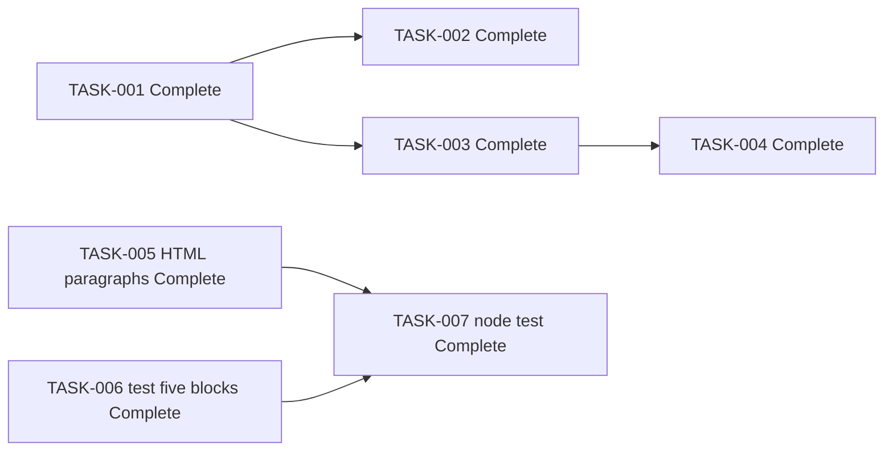

# Implementation Plan: Hari-Agents welcome page

## Document status

- Status: Complete
- Source architecture: `plans/hari-agents/architecture.md` (Approved, 2026-10-05; AD-13 through AD-17)
- Architecture status: Approved
- Design review: Passed (delta review 2026-10-05 for FR-13 through FR-16)
- Ready for implementation: Yes
- Planning date: 2026-10-05
- Prior implementation date: 2026-10-05 (TASK-001 through TASK-004)
- Delta planning date: 2026-10-05 (TASK-005 through TASK-007)
- Production coding: TASK-001 through TASK-007 Complete. FR-13 through FR-16 implemented 2026-10-05.

### Allowed status values

| Status | Meaning |
|--------|---------|
| Draft | Plan is incomplete or awaiting architecture approval. |
| Ready for Implementation | Tasks are dependency-ordered and unblocked enough for the implementation agent. |
| In Progress | Implementation of one or more tasks has started. |
| Blocked | A missing decision or failed predecessor prevents safe progress. |
| Complete | All tasks meet their Definition of Done. |

This document is **Complete**. TASK-001 through TASK-007 are **Complete**. `index.html`, `styles.css`, and `welcome-page.test.mjs` already exist under `plans/hari-agents/`. This revision does not authorize editing `architecture.md`, `requirements.md`, or `styles.css`.

---

## 1. Scope

Deliver one static welcome page under `plans/hari-agents/`. The original page is already implemented. This delta adds two visible paragraphs inside the existing `main`, in the approved order, and updates the structure test to expect them.

| Item | Exact value |
|------|-------------|
| Document title | `Hari-Agents` (unchanged) |
| Visible heading (`h1`) | `Hari-Agents` (exactly one; unchanged) |
| Greeting | `Welcome to Hari-Agents` (unchanged) |
| Tagline | `A personal agent workspace.` (unchanged) |
| Year paragraph | `2026` (paragraph text is the year token only) |
| Instruction paragraph | `Page used for QA engineer` (exact, singular, case-sensitive) |
| Main order | 1 `h1` Hari-Agents, 2 greeting, 3 tagline, 4 year, 5 instruction |
| Canvas / text | `#ffffff` / `#1a1a1a` (unchanged) |
| Stack | Plain HTML + CSS; no SPA, no npm, no page JavaScript, no remote URLs, no new technology |
| Verification | `welcome-page.test.mjs` via `node --test` (zero extra dependencies) |

Original request: create welcome page "Hari-Agents". Additive request: show year `2026` and instruction `Page used for QA engineer` on that same page.

### 1.1 In scope for this delta

- Add `<p>2026</p>` and `<p>Page used for QA engineer</p>` to `index.html` inside the existing `main`, after the tagline, in that order (TASK-005). Keep existing copy.
- Update `welcome-page.test.mjs` so the main assertion expects those five blocks, and add assertions for the exact year token and the exact instruction (TASK-006). Keep existing title, `h1`, no-script, no-form, and no-remote checks.
- Run `node --test` and record the result in §6 (TASK-007). Recorded 2026-10-05: pass, exit 0, 14 tests, 0 failures.

### 1.2 CSS

`styles.css` is unchanged. No CSS task is in this delta.

Existing `p` rules already set size, line-height, spacing, and wrapping. `p:last-child` already clears the bottom margin of the last paragraph. Body already sets canvas `#ffffff` and text `#1a1a1a`, so the new paragraphs inherit AD-12 contrast. AD-16 does not require a new first-screen layout rule: heading, greeting, and tagline stay first in `main`, and the year and instruction only need to be visible after load. Adding two short paragraphs does not require a new selector, token, or technology.

### 1.3 Out of scope (do not implement)

Auth, APIs, analytics, in-page Jira, multi-page navigation, agent execution, SPA/frameworks, npm, page `<script>`, remote assets, `US-LOGO-1` logo/PWA/favicon, decorative images, theme toggle, backend, a second page, a second `h1`, a copyright sentence, putting `2026` in the document title, a trailing space after `engineer`, files outside `plans/hari-agents/`, and edits to `styles.css`, `architecture.md`, or `requirements.md`.

---

## 2. Constraints for the implementation agent

1. For this delta, edit only `plans/hari-agents/index.html` (TASK-005), `plans/hari-agents/welcome-page.test.mjs` (TASK-006), and §6 of this plan after TASK-007.
2. Do not edit `styles.css`. Paragraph presentation already covers the new lines (§1.2).
3. Do not edit `architecture.md` or `requirements.md`.
4. Do not add `package.json`, `node_modules`, build scripts, or inline `<style>`.
5. Do not put `<script>` in `index.html` (inline or `src`). Do not link `welcome-page.test.mjs` from the page.
6. The only stylesheet link remains same-folder `href="styles.css"`. No remote `href`, `src`, or `@import`.
7. Do not place page files at the Cursor repo root or in a new root `hari-agents/` folder (gitignored).
8. Do not link `architecture.md` or `impl-plan.md` from `index.html`.
9. Keep document title and the only `h1` as exactly `Hari-Agents`. Keep greeting `Welcome to Hari-Agents` and tagline `A personal agent workspace.`
10. Year paragraph text is `2026` only. Do not use a copyright sentence or a longer digit run.
11. Instruction text is exactly `Page used for QA engineer`. Singular. Case-sensitive. A trailing space after `engineer` is not required.
12. Do not mark TASK-005, TASK-006, or TASK-007 Complete in this planning document. The implementation agent marks them Complete only after the work and the test run.
13. Visual/NFR checks (contrast, ~1280×800 first viewport for heading/greeting/tagline, ~375×667 wrap) stay human checks. C-TEST does not prove them. Contrast tokens are already in CSS.

---

## 3. Delivery files

```text
plans/hari-agents/
  architecture.md              # Approved — do not rewrite
  impl-plan.md                 # this document
  requirements.md              # Approved FR-1..FR-16 — do not rewrite
  index.html                   # TASK-001 Complete; TASK-005 updates main
  styles.css                   # TASK-002 Complete; unchanged in this delta
  welcome-page.test.mjs        # TASK-003 Complete; TASK-006 updates assertions
```

---

## 4. Task list

Prior work stays complete. Execution order for the delta: TASK-005 and TASK-006 may be authored in either order or together, because both follow the approved contract. TASK-007 starts only after TASK-005 and TASK-006 are done.

TASK-005, TASK-006, and TASK-007 are **Complete**. Architecture contracts AD-13 through AD-17 are complete, so none of them are Blocked. They were marked Complete after the 2026-10-05 test run exited 0.

---

### TASK-001: `index.html` semantic structure

| Field | Value |
|-------|--------|
| Task ID | TASK-001 |
| Title | `index.html` semantic structure |
| Priority | P0 |
| Status | Complete |
| Dependencies | None |
| Blocked status | No |
| Component | C-PAGE |
| Files | `plans/hari-agents/index.html` (created) |

**Description**

Create a single HTML5 document that satisfies the original architecture HTML contract: `lang="en"`, charset, viewport meta, title `Hari-Agents`, same-folder `styles.css`, one `h1` `Hari-Agents`, greeting `Welcome to Hari-Agents`, tagline `A personal agent workspace.`, one `main`, no form, no script, no remote URL.

**Expected outcome**

Original welcome page exists with title, one `h1`, greeting, and tagline inside `main`. Met on 2026-10-05. This delta does not reopen the task. TASK-005 extends the same file.

**Validation**

- File exists at `plans/hari-agents/index.html`.
- Source contains the exact title, `h1`, greeting, tagline, viewport meta, `lang="en"`, charset, and same-folder CSS link.
- Source contains no `<form>`, no `<script>`, and no `http://` or `https://` URLs.

**Definition of Done**

- [x] HTML contract for the original page is met with exact copy for title, `h1`, greeting, and tagline.
- [x] Single `main` landmark; single `h1`.
- [x] No forms, scripts, or remote URLs.
- [x] Page remains readable as unstyled HTML if CSS is missing (FR-12).

---

### TASK-002: `styles.css` layout / contrast / responsive

| Field | Value |
|-------|--------|
| Task ID | TASK-002 |
| Title | `styles.css` layout / contrast / responsive |
| Priority | P0 |
| Status | Complete |
| Dependencies | TASK-001 |
| Blocked status | No |
| Component | C-STYLE |
| Files | `plans/hari-agents/styles.css` (created; not edited in this delta) |

**Description**

Create a same-folder stylesheet with canvas `#ffffff`, text `#1a1a1a`, a system font stack, first-viewport composition, and wrapping at ~375×667. No webfonts, CDN, `@import`, theme toggle, or required images.

**Expected outcome**

Stylesheet exists and already styles every `p`, including paragraphs added later. No further CSS work is required for FR-13 through FR-16 (§1.2).

**Validation**

- File exists at `plans/hari-agents/styles.css`.
- Tokens `#ffffff` and `#1a1a1a` are the page background and text colors.
- No `@import`, no `url(http`, no `url(https`.

**Definition of Done**

- [x] Light readable theme uses the approved tokens.
- [x] System fonts only; no remote assets.
- [x] First-viewport composition on ~1280×800.
- [x] No clip of heading/greeting at ~375×667.
- [x] Contrast remains a known WCAG 2.2 pass for normal text (white / near-black).

---

### TASK-003: `welcome-page.test.mjs` string assertions

| Field | Value |
|-------|--------|
| Task ID | TASK-003 |
| Title | `welcome-page.test.mjs` string assertions |
| Priority | P0 |
| Status | Complete |
| Dependencies | TASK-001 |
| Blocked status | No |
| Component | C-TEST |
| Files | `plans/hari-agents/welcome-page.test.mjs` (created) |

**Description**

Create a zero-dependency ESM test using `node:test`, `node:assert`, and `fs.readFileSync` on `index.html`. Assert title, one `h1`, greeting, tagline, viewport, relative stylesheet, `lang`, charset, and the absence of form, script, remote URLs, and analytics markers. The current main assertion expects only heading, greeting, and tagline. TASK-006 replaces that shape.

**Expected outcome**

Structure test exists and passed on 2026-10-05 against the three-block `main` (12 tests, 0 failures). That main assertion is now stale relative to AD-17 and is the subject of TASK-006.

**Validation**

- File exists at `plans/hari-agents/welcome-page.test.mjs`.
- Imports only Node built-ins.
- Test file is not referenced from `index.html`.

**Definition of Done**

- [x] Original §7.2 checks were covered for the three-block page.
- [x] Zero extra dependencies.
- [x] File is a verification artifact only (not a runtime asset).

---

### TASK-004: Run `node --test` and record results (original page)

| Field | Value |
|-------|--------|
| Task ID | TASK-004 |
| Title | Run `node --test` and record results (original page) |
| Priority | P0 |
| Status | Complete |
| Dependencies | TASK-001, TASK-003 |
| Blocked status | No |
| Component | C-RUNNER (local) |
| Files | This plan, §6 historical result |

**Description**

Run `node --test welcome-page.test.mjs` against the original three-block page and record the result. This task is historical. The delta re-run is TASK-007, recorded in §6.2.

**Expected outcome**

Recorded pass on 2026-10-05: 12 tests, 0 failures, exit 0. See §6.1.

**Validation**

- Command exited 0.
- Output showed all tests passing.
- §6.1 contains the recorded result.

**Definition of Done**

- [x] `node --test welcome-page.test.mjs` passed with zero failures for the original page.
- [x] Results are written into §6.1.
- [x] No `package.json` or extra dependencies were introduced.

---

### TASK-005: Add year and instruction paragraphs

| Field | Value |
|-------|--------|
| Task ID | TASK-005 |
| Title | Add year and instruction paragraphs |
| Priority | P0 |
| Status | Complete |
| Dependencies | None (TASK-001 through TASK-004 are already Complete) |
| Blocked status | No |
| Component | C-PAGE |
| Files | `plans/hari-agents/index.html` (update only) |

**Description**

Add the year and instruction paragraphs to the existing `index.html` inside the current `main`, after the tagline, in the approved order. Keep every existing string. Do not add a script, form, remote URL, second `h1`, copyright sentence, or new technology. Do not change `styles.css`.

Required `main` order:

1. `<h1>Hari-Agents</h1>`
2. `<p>Welcome to Hari-Agents</p>`
3. `<p>A personal agent workspace.</p>`
4. `<p>2026</p>` — the paragraph's text is the year token `2026` only (AD-13, FR-13). Not a comment, hidden attribute, document title, or longer digit run such as `20260`.
5. `<p>Page used for QA engineer</p>` — exact text, singular, case-sensitive (AD-14, FR-14). A trailing space after `engineer` is not required. Do not use `engineers` or a reworded sentence.

Both new paragraphs are in the initial HTML and visible after load with no click, form, or API (AD-16, FR-15). Leave `<title>Hari-Agents</title>` and the single `h1` unchanged (FR-16).

**Expected outcome**

`index.html` `main` contains the five blocks in the order above. Existing title, heading, greeting, tagline, viewport meta, `lang`, charset, and same-folder stylesheet link remain. The file still has no `<form>`, no `<script>`, and no `http://` or `https://` URL.

**Validation**

- `main` source order is `h1`, greeting `p`, tagline `p`, `<p>2026</p>`, `<p>Page used for QA engineer</p>`.
- Paragraph text of the year element is exactly `2026`.
- Instruction text is exactly `Page used for QA engineer`.
- Title is still exactly `<title>Hari-Agents</title>`. Exactly one `<h1>Hari-Agents</h1>`.
- Greeting and tagline sentences are unchanged.
- No `<form>`, no `<script>`, no remote URL.

**Definition of Done**

- [x] Year paragraph text is `2026` and is not only part of a longer digit run.
- [x] Instruction paragraph text is exactly `Page used for QA engineer`.
- [x] Both paragraphs are inside the existing `main`, after the tagline, in the AD-15 order.
- [x] Title, single `h1`, greeting, and tagline are unchanged.
- [x] No form, script, remote URL, or second page was added.
- [x] `styles.css` was not modified.

---

### TASK-006: Expect five blocks in the structure test

| Field | Value |
|-------|--------|
| Task ID | TASK-006 |
| Title | Expect five blocks in the structure test |
| Priority | P0 |
| Status | Complete |
| Dependencies | None for authoring (contract is AD-15 and AD-17). Pass validation waits for TASK-005. |
| Blocked status | No |
| Component | C-TEST |
| Files | `plans/hari-agents/welcome-page.test.mjs` (update only) |

**Description**

Update `welcome-page.test.mjs` so the main assertion expects the five blocks inside `main` in the AD-15 order. Add assertions for the exact year token and the exact instruction. Keep the existing title, single-`h1`, greeting, tagline, viewport, relative stylesheet, `lang`, charset, no-form, no-script, no-remote, and no-analytics checks. Use only Node built-ins (`node:test`, `node:assert/strict`, `node:fs`, `node:path`, `node:url`). Do not add a test runner, browser automation, or npm package.

The test currently named `single main wraps heading greeting and tagline` asserts this shape and will reject the new paragraphs:

```text
<main>
  <h1>Hari-Agents</h1>
  <p>Welcome to Hari-Agents</p>
  <p>A personal agent workspace.</p>
</main>
```

Replace that assertion (rename the test so the name matches the five-block contract) so `main` is expected to contain, in order:

1. `<h1>Hari-Agents</h1>`
2. `<p>Welcome to Hari-Agents</p>`
3. `<p>A personal agent workspace.</p>`
4. `<p>2026</p>`
5. `<p>Page used for QA engineer</p>`

Year check: treat `2026` as a year token. A bare substring check that also matches a longer digit run such as `20260` is not enough. Match the paragraph whose text is `2026`, and do not accept `2026` only as part of a longer digit sequence.

Instruction check: the exact string `Page used for QA engineer`. Case-sensitive. Do not require a trailing space after `engineer`. Do not accept `Page used for QA engineers`.

Keep these existing tests:

- document title is exactly `Hari-Agents`
- exactly one `h1` `Hari-Agents`
- greeting `Welcome to Hari-Agents` is present
- tagline `A personal agent workspace.` is present
- no form element
- no script element
- no remote `http://` or `https://` URLs
- `styles.css` is linked relatively
- viewport meta includes `width=device-width`
- `html` `lang` is `en` and charset is present
- no analytics markers

**Expected outcome**

The structure test expects the five-block `main` and asserts the year token and the exact instruction, while the previous title, `h1`, no-script, no-form, and no-remote checks still run. The test file stays a verification artifact and is not linked from `index.html`.

**Validation**

- The updated main assertion fails if either new paragraph is missing, reordered, or placed outside `main`.
- The year assertion fails when `2026` appears only inside a longer digit run.
- The instruction assertion fails on a plural or differently cased sentence.
- Existing title, single-`h1`, no-`<script>`, no-`<form>`, and no-remote-URL assertions remain.
- Imports stay limited to Node built-ins.

**Definition of Done**

- [x] Main assertion expects the five blocks in the approved order.
- [x] A dedicated assertion requires the year token `2026` as paragraph text, not a longer digit run.
- [x] A dedicated assertion requires the exact instruction `Page used for QA engineer`.
- [x] Title, single-`h1`, no-script, no-form, and no-remote checks are still present.
- [x] No new test technology or npm dependency was added.
- [x] `index.html` does not reference the test file.

---

### TASK-007: Run `node --test` for the delta and record the result

| Field | Value |
|-------|--------|
| Task ID | TASK-007 |
| Title | Run `node --test` for the delta and record the result |
| Priority | P0 |
| Status | Complete |
| Dependencies | TASK-005, TASK-006 |
| Blocked status | No |
| Component | C-RUNNER (local) |
| Files | This plan, §6.2 (update after the run) |

**Description**

After TASK-005 and TASK-006 are done, from `plans/hari-agents/` (or with an equivalent path argument), run:

```text
node --test welcome-page.test.mjs
```

Record the date, command, exit status, pass/fail counts, and any failure names in §6.2. Do not add npm. Do not treat visual contrast or viewport wrap as proven by this command.

The implementation agent ran the command on 2026-10-05 and recorded the result in §6.2: pass, exit 0, 14 tests, 0 failures. This task is Complete because that run exited 0.

**Expected outcome**

§6.2 records the 2026-10-05 command result: pass, exit 0, 14 passed, 0 failed, including the five-block main assertion, the year-token assertion, and the exact-instruction assertion.

**Validation**

- Command is `node --test` on `welcome-page.test.mjs` only.
- §6.2 states the outcome: pass, exit 0, 14 passed, 0 failed.
- No `package.json` is added.

**Definition of Done**

- [x] `node --test welcome-page.test.mjs` has been run by the implementation agent after TASK-005 and TASK-006.
- [x] §6.2 records the date, command, and pass/fail result (it must no longer say only "not yet run").
- [x] The task is marked Complete only when the recorded run exits 0 with zero failures.
- [x] No `package.json` or extra dependencies were introduced.

---

## 5. Dependency graph

```text
TASK-001 index.html                         Complete
    ├── TASK-002 styles.css                 Complete (unchanged in this delta)
    └── TASK-003 welcome-page.test.mjs      Complete
            └── TASK-004 node --test        Complete (historical)

TASK-005 index.html year + instruction      Complete, depends on none
TASK-006 update structure test              Complete, depends on none for authoring
TASK-007 node --test delta notes            Complete, depends on TASK-005 and TASK-006
```



**Blocked tasks:** none.

TASK-005, TASK-006, and TASK-007 are Complete. TASK-007 stayed dependent on TASK-005 and TASK-006 and was marked Complete only after those two were done and the test run exited 0.

---

## 6. Implementation notes

### 6.1 Historical result (TASK-004, original page)

Implemented 2026-10-05. TASK-001 through TASK-004 are Complete. This result does not cover FR-13 through FR-16. At the time of this run the main test expected only heading, greeting, and tagline, so this pass is historical. TASK-007 is the delta run.

| Field | Value |
|-------|--------|
| Date run | 2026-10-05 |
| Working directory | equivalent path argument (absolute test file) |
| Command | `node --test C:/Users/Hariprasanth_Baskara/.cursor/plans/hari-agents/welcome-page.test.mjs` |
| Result | pass (exit 0) |
| Tests passed | 12 |
| Tests failed | 0 |
| Duration | 309.4949 ms |

```text
✔ document title is exactly Hari-Agents
✔ exactly one h1 Hari-Agents
✔ single main wraps heading greeting and tagline
✔ greeting Welcome to Hari-Agents is present
✔ tagline A personal agent workspace. is present
✔ no form element
✔ no script element
✔ no remote http or https URLs
✔ styles.css is linked relatively
✔ viewport meta includes width=device-width
✔ html lang is en and charset is present
✔ no analytics markers
ℹ tests 12
ℹ pass 12
ℹ fail 0
```

Original page notes:

- `index.html` uses `lang="en"`, charset, viewport `width=device-width`, exact title/`h1`/greeting/tagline, one `main`, same-folder `styles.css` only. No form, script, or remote URLs. Year and instruction paragraphs are not in the file yet.
- `styles.css` uses `#ffffff` / `#1a1a1a`, a system font stack, flex-centered layout, `clamp` heading size, `p` rules, and `overflow-wrap`. No `@import` or remote `url()`. Those `p` rules cover the delta, so CSS stays unchanged.
- `welcome-page.test.mjs` reads `index.html` via `node:fs` + `node:path` from `import.meta.url`. Node built-ins only. TASK-006 must change the three-block `main` assertion.
- `requirements.md` in this folder now includes FR-13 through FR-16. This plan does not edit it.

### 6.2 Delta result (TASK-007)

Implemented 2026-10-05. TASK-005, TASK-006, and TASK-007 are Complete. Command was run from `plans/hari-agents/` after the HTML and test updates.

| Field | Value |
|-------|--------|
| Date run | 2026-10-05 |
| Working directory | `plans/hari-agents/` |
| Command | `node --test welcome-page.test.mjs` |
| Exit code | 0 |
| Result | pass |
| Tests passed | 14 |
| Tests failed | 0 |
| Duration | 153.5404 ms |

```text
✔ document title is exactly Hari-Agents
✔ exactly one h1 Hari-Agents
✔ single main wraps heading greeting tagline year and instruction
✔ visible year is the token 2026
✔ exact instruction Page used for QA engineer is present
✔ greeting Welcome to Hari-Agents is present
✔ tagline A personal agent workspace. is present
✔ no form element
✔ no script element
✔ no remote http or https URLs
✔ styles.css is linked relatively
✔ viewport meta includes width=device-width
✔ html lang is en and charset is present
✔ no analytics markers
ℹ tests 14
ℹ pass 14
ℹ fail 0
```

Delta notes:

- `index.html` `main` order is `h1` Hari-Agents, greeting, tagline, `<p>2026</p>`, `<p>Page used for QA engineer</p>`. Title, single `h1`, viewport, `lang="en"`, charset, and same-folder `styles.css` are unchanged. No form, script, or remote URL.
- `styles.css` was not modified. Contrast and ~375×667 / ~1280×800 viewport checks were not browser-verified in this session.
- `welcome-page.test.mjs` expects the five blocks in order and asserts the year token `2026` as paragraph text and the exact instruction. Node built-ins only.

---

## 7. Requirement coverage

| Requirement | Task(s) |
|-------------|---------|
| FR-1 Title exactly `Hari-Agents` | TASK-001 Complete; kept by TASK-005 and TASK-006 |
| FR-2 Visible `h1` accessible name `Hari-Agents` | TASK-001, TASK-002 Complete; kept by TASK-005 |
| FR-3 Greeting `Welcome` + `Hari-Agents` | TASK-001 Complete; kept by TASK-005 and TASK-006 |
| FR-4 Personal agent workspace line | TASK-001 Complete; kept by TASK-005 and TASK-006 |
| FR-5 First viewport; no click/form/API | TASK-001, TASK-002 Complete; new lines do not add a click, form, or API |
| FR-6 Static files; no backend | All tasks |
| FR-7 No input collection | TASK-001 Complete; TASK-005 and TASK-006 keep the no-form check |
| FR-8 No analytics / no page JS / no remote URLs | TASK-001, TASK-003 Complete; TASK-005 and TASK-006 keep those checks |
| FR-9 Single semantic `h1` | TASK-001, TASK-003 Complete; TASK-005 does not add a heading |
| FR-10 Contrast | TASK-002 Complete; inherited by new `p` elements; CSS unchanged |
| FR-11 Desktop + ~375 layout; viewport meta | TASK-001, TASK-002, TASK-003 Complete; viewport check kept by TASK-006 |
| FR-12 Text identity if decoration fails | TASK-001 Complete |
| FR-13 Visible year token `2026` | TASK-005, TASK-006, TASK-007 |
| FR-14 Exact text `Page used for QA engineer` | TASK-005, TASK-006, TASK-007 |
| FR-15 Both new strings visible after load; no click, form, or API | TASK-005 |
| FR-16 Keep title, one `h1`, greeting, and tagline | TASK-005, TASK-006 |
| NFR-1 Contrast tokens | TASK-002 Complete; no new tokens |
| NFR-2 Chromium `file://` open | TASK-002 visual check already done for the original page; delta copy is in the same static file |
| NFR-3 HTML/CSS stack | No new technology |

---

## 8. Pipeline readiness

| Item | Value |
|------|--------|
| Current stage | Implementation of FR-13 through FR-16 |
| Input artifact | Approved `architecture.md` (AD-13 through AD-17) and approved `requirements.md` (FR-13 through FR-16) |
| Output artifact | `index.html`, `welcome-page.test.mjs`, and this `impl-plan.md` (§6.2) |
| Architecture status | Approved |
| Design review | Passed |
| Status | Complete |
| Next stage | Review and Verify |
| Production coding of the delta | Complete (TASK-005 through TASK-007) |
| CSS | Unchanged |
| TASK-007 command result | pass, exit 0, 14 passed, 0 failed (2026-10-05) |
| Blocked tasks | none |
