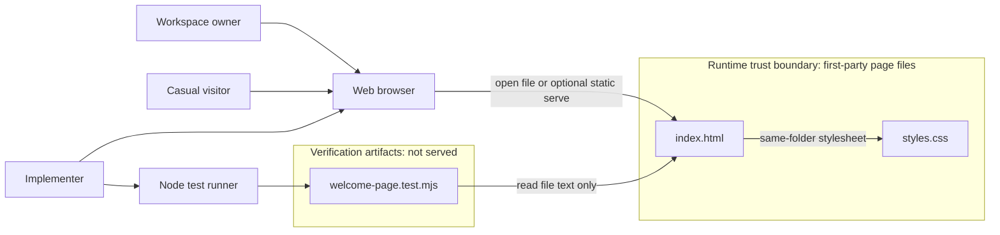
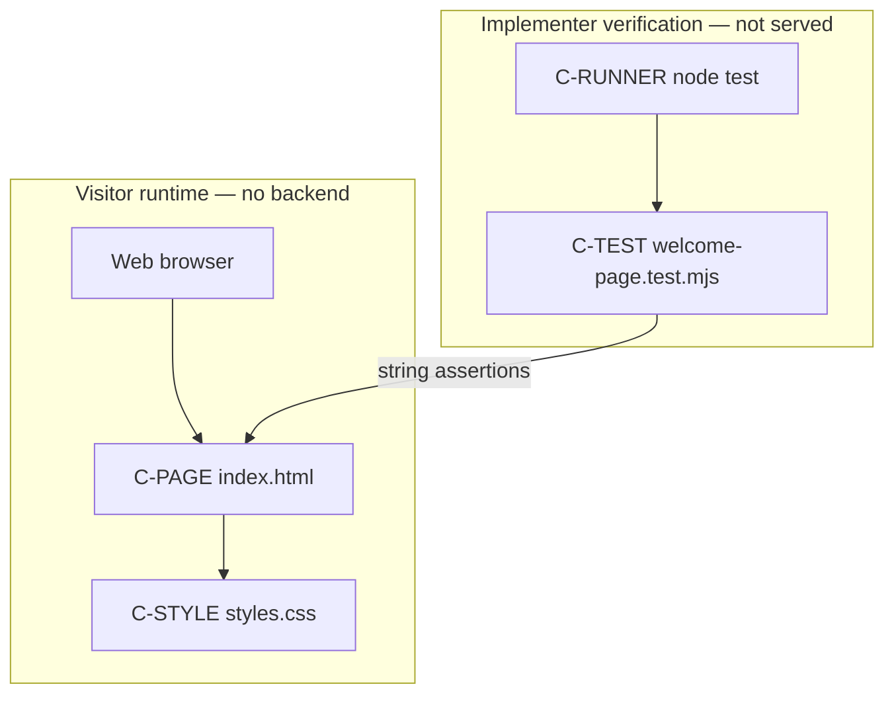
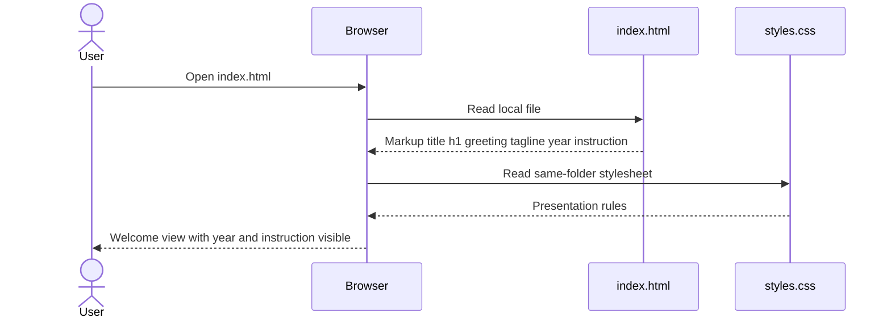
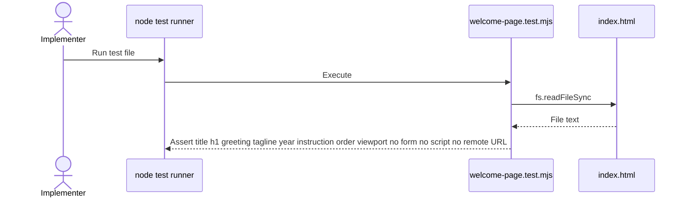

# Architecture: Hari-Agents welcome page

## Document status

- Status: Needs Review
- Design review: Pending (not re-run for this revision)
- Ready for implementation: No
- Prior review date: 2026-10-05 (FR-1 through FR-12 only; does not cover this revision)

### Allowed status values

| Status | Meaning |
|--------|---------|
| Proposed | Architecture drafted from approved requirements; awaiting Design Review. |
| Needs Review | Material changes were made and require another Design Review pass. |
| Approved | Design Review passed; implementation planning may begin. |
| Blocked | A finding or missing decision prevents safe progress. |
| Superseded | Replaced by a later architecture document. |

This document was **Approved** on 2026-10-05 for FR-1 through FR-12. This revision adds architecture for approved additive requirements FR-13 through FR-16 (assumptions A-1 through A-8). Those material changes have not had Design Review. Status is **Needs Review**. Ready for implementation: **No**, until Design Review passes. Production HTML, CSS, and tests are not changed by this document update.

---

## 1. Architecture overview

### 1.1 Recommended style

**Single-document static presentation.** One HTML document plus one same-folder stylesheet, opened in a browser from the local filesystem (`file://`) or an optional trivial static file server. No application runtime, no SPA framework, no backend, no build step.

### 1.2 Why this style fits

Approved scope is one welcome/landing surface: document title `Hari-Agents`, one semantic `h1`, a greeting, a personal-workspace branding line, a visible year paragraph `2026`, and a visible instruction paragraph `Page used for QA engineer`. Those needs are markup and CSS. A framework, bundler, or API would add cost without covering any additional functional requirement. No new technology is introduced for the additive copy.

Workspace facts reinforce the choice: there is no existing HTML app, no `package.json`, and no first-class application remote. New files at the Cursor repo root (or a new root `hari-agents/` folder) are ignored by the managed `.gitignore` `*` rule. Delivery under `plans/hari-agents/` is versionable because `plans/` is allowlisted.

### 1.3 Major system boundaries

| Boundary | Inside | Outside |
|----------|--------|---------|
| Product surface | `index.html` + `styles.css` | Auth, APIs, multi-page app, agent execution, Jira-in-page |
| Delivery | Files under `plans/hari-agents/` | Repo-root product code, `US-LOGO-1` logo/PWA/favicon program |
| Runtime | Browser rendering of static files | Node.js except the optional local test runner |
| Trust | First-party `index.html` + `styles.css` only | Third-party scripts, fonts, analytics, remote assets, page JS |

### 1.4 Primary actors and external systems

- **Workspace owner** and **casual visitor** open the page in a browser.
- **Implementer** authors and visually checks the static files.
- **Web browser** is the only runtime that must render welcome content.
- **Node.js** is optional and used only for `node --test` string assertions; it is not a production dependency.
- **No production backend, identity provider, analytics vendor, or issue tracker** participates at runtime.

### 1.5 Important architecture decisions

| ID | Decision | Rationale |
|----|----------|-----------|
| AD-1 | Plain HTML + CSS; no SPA framework | Scope is one static page; NFR-3 leaves stack as an architecture choice. |
| AD-2 | Place the page and SDLC docs under `plans/hari-agents/` | `.gitignore` ignores repo-root and unlisted folders; `plans/` is allowlisted. |
| AD-3 | Separate `styles.css` in the same folder | Keeps presentation testable and avoids a bundler; still static. |
| AD-4 | Text wordmark only; no decorative image required | Satisfies FR-12 and the text-wordmark choice; avoids image-load identity failure. |
| AD-5 | System font stack; no webfont CDN | Avoids third-party network dependency and tracking surface (FR-8). |
| AD-6 | Open via `file://` as the primary verification path | Meets FR-6 / NFR-2 without a server. A local static server is optional, not required. |
| AD-7 | Zero-dependency `node --test` + `assert` on HTML file text | Workspace constraint; no npm. Tests are not a runtime component. |
| AD-8 | Do not fold `US-LOGO-1` into this design | Confirmed separate draft; favicon/PWA/OG are out of scope. |
| AD-9 | No backend, secrets, cookies, or user input | FR-6, FR-7, FR-8. |
| AD-10 | No JavaScript in the delivered page | FR-7/FR-8 and NFR-3: the welcome surface needs no client script. C-TEST is not linked from HTML. |
| AD-11 | Require a viewport meta tag | FR-11 / AC-FR-11.1: without `width=device-width`, ~375×667 layout width is unreliable. |
| AD-12 | Default light palette `#ffffff` / `#1a1a1a` | Known WCAG 2.2 pass for normal text (well above 4.5:1). Brand colors were not specified; this is a conservative default, not a brand book. |
| AD-13 | Dedicated visible year paragraph whose text is `2026` | FR-13 and assumption A-5. The four digits are the whole paragraph, not part of a longer digit run, not an HTML comment, and not document metadata. A copyright sentence is not used. |
| AD-14 | Dedicated visible instruction paragraph whose text is exactly `Page used for QA engineer` | FR-14 and assumptions A-2 and A-8. Match is case-sensitive and singular. A trailing space after `engineer` is not required. A plural or reworded sentence does not satisfy the requirement. |
| AD-15 | Both new paragraphs live inside the existing `main`, after the tagline, in a fixed order | FR-16 and assumption A-4. Document title stays `Hari-Agents`. Exactly one `h1` stays `Hari-Agents`. Order: `h1`, greeting, tagline, year, instruction. |
| AD-16 | New lines are in the initial HTML and visible after load; first-screen placement is not mandatory | FR-15. Requirements Q-1 default: visible after load is enough. Prefer `main` so the lines stay with the welcome content and typically remain in the first viewport because the page is short and centered. |
| AD-17 | C-TEST must expect the two new paragraphs inside `main` in the AD-15 order | `welcome-page.test.mjs` currently asserts `main` contains only `h1`, greeting, and tagline. That assertion must change. The test must still forbid `<script>`, `<form>`, and remote URLs. No new test technology. |

**Additive revision note.** Contrast tokens stay `#ffffff` (canvas) and `#1a1a1a` (text) per AD-12. The new paragraphs use those same tokens. No new technology is introduced: the page remains plain HTML + CSS, with no page JavaScript and no backend (AD-1, AD-10).

---

## 2. System context

### 2.1 Users and actors

| ID | Actor | Type | Interaction |
|----|-------|------|-------------|
| A-U1 | Workspace owner | Human | Opens the page to confirm Hari-Agents identity. |
| A-U2 | Casual visitor | Human | Reads title, greeting, purpose line, year `2026`, and instruction `Page used for QA engineer`. |
| A-U3 | Implementer | Human | Edits static files and runs visual / `node --test` checks. |

### 2.2 Internal systems

| ID | System | Ownership | Notes |
|----|--------|-----------|-------|
| C-PAGE | Welcome document (`index.html`) | This delivery | Sole product surface. |
| C-STYLE | Presentation (`styles.css`) | This delivery | Layout, contrast, first-viewport, narrow-viewport wrapping. |
| C-TEST | Structure test (`welcome-page.test.mjs`) | This delivery | Reads HTML as text; never served to visitors. |

### 2.3 External systems

None at runtime. Adjacent, non-runtime artifacts:

- Cursor SDLC command flow (consumes this document).
- Repo-root `requirements.md` (`US-LOGO-1`) — related brand draft only; not a dependency.

### 2.4 Input sources and output destinations

| Direction | What | Source / destination |
|-----------|------|----------------------|
| Input | Static HTML and CSS bytes | Local files under `plans/hari-agents/` |
| Input (test only) | HTML file contents as a string | `welcome-page.test.mjs` via `fs.readFileSync` |
| Output | Painted welcome view + tab title | Browser viewport and document title |
| Output (test only) | Pass/fail assertions | Terminal from `node --test` |

There is no user-generated data, no persistence, and no outbound application traffic. The year and the QA instruction are static copy in `index.html`, not fetched data.

### 2.5 Trust and ownership boundaries

- **Runtime trust boundary:** `index.html` and `styles.css` only. The browser must not load scripts, fonts, images, or pixels from untrusted origins, and must not execute page JavaScript (AD-10).
- **Verification artifacts:** `welcome-page.test.mjs` is first-party but is not a runtime asset and must not be linked or served to visitors.
- **Ownership boundary:** Hari-Agents welcome files and SDLC docs in `plans/hari-agents/`. The rest of the Cursor config repo (commands, skills, plugins, `US-LOGO-1`) is adjacent configuration, not this product.
- **No secrets** cross any boundary.

### 2.6 Context diagram

The context diagram is unchanged. FR-13 and FR-14 add visible copy inside `index.html`. They do not add a runtime system, API, script, or trust-boundary crossing.



---

## 3. Architecture principles

1. **Static first.** Required content, including the year and the QA instruction, is in the HTML file. No API, session, or build is needed to greet the visitor.
2. **One page, one `h1`.** Identity is the product name as text, not a routed application. The year is a paragraph, not a second heading and not part of the document title.
3. **No third-party runtime and no page JavaScript.** No remote scripts, fonts, analytics, or pixels; `index.html` contains no `<script>` (AD-10).
4. **Text survives decoration.** If a later optional mark is added, the wordmark stays visible text (FR-12). This design does not require a mark.
5. **Keep SDLC artifacts with the page.** Architecture, later impl-plan, page, styles, and tests live together under `plans/hari-agents/`.
6. **Do not expand scope.** Auth, APIs, Jira-in-page, agent execution, PWA/favicon, and SPA stacks stay out. The QA instruction is visible copy on this same page, not a separate build or gated view (assumption A-7).

---

## 4. Components and responsibilities

### 4.1 Component catalog

| ID | Component | Responsibility | Does not do |
|----|-----------|----------------|-------------|
| C-PAGE | `index.html` | Document title exactly `Hari-Agents`; `charset` and viewport meta (AD-11); single `h1` whose accessible name is `Hari-Agents`; greeting `Welcome to Hari-Agents`; branding line `A personal agent workspace.`; year paragraph whose text is `2026` (AD-13); instruction paragraph whose text is exactly `Page used for QA engineer` (AD-14); both new paragraphs inside the existing `main` in the AD-15 order, present in the initial markup (AD-16); semantic landmark (`main`); same-folder CSS only; no `form`; no `<script>`; no remote `href`/`src`. | Routing, data fetch, auth, logo system, page JS, a second `h1`, changing the document title, a copyright sentence, a separate QA page |
| C-STYLE | `styles.css` | Light readable theme using default tokens `#ffffff` / `#1a1a1a` (AD-12) for existing and new paragraphs; no new palette and no new technology; WCAG 2.2 contrast (NFR-1); first-viewport composition on ~1280×800 for heading, greeting, and tagline (FR-5); year and instruction share `main` and typically remain in that viewport because the page is short and centered (AD-16), without a hard first-screen requirement; wrapping without clipping heading/greeting at ~375×667; system fonts. | Business copy, tracking, new frameworks |
| C-TEST | `welcome-page.test.mjs` | `node --test` + `node:assert` string checks on HTML: title, single `h1`, greeting, tagline, year paragraph, instruction paragraph, `main` child order (AD-17), viewport meta, absence of `form`, absence of `<script>`, absence of remote URLs, absence of analytics markers. | Browser automation, visual regression, serving the page, a new test runner |
| C-BROWSER | Web browser | Renders C-PAGE + C-STYLE; shows tab title. Not authored. | — |
| C-RUNNER | Node.js test runner | Optional local verification. Not required to view the page. | Production hosting |

### 4.2 Component diagram



### 4.3 Data ownership

| Data | Owner | Persistence | Notes |
|------|-------|-------------|-------|
| Product name `Hari-Agents` | C-PAGE (`<title>`, `h1`, greeting) | Source files | Canonical identity is text. Title and `h1` stay exactly `Hari-Agents` (FR-16). |
| Greeting and tagline | C-PAGE | Source files | Exact copy required by FR-16: `Welcome to Hari-Agents` and `A personal agent workspace.` |
| Year `2026` | C-PAGE | Source files | One paragraph whose text is `2026` (AD-13, FR-13). Not a copyright line. |
| Instruction `Page used for QA engineer` | C-PAGE | Source files | One paragraph with that exact text (AD-14, FR-14). Singular `engineer`. |
| Colors, spacing, typography | C-STYLE | Source files | Default `#ffffff` / `#1a1a1a` (AD-12); no brand book; no new tokens for the additive lines. |
| Visitor data | None | None | No collection (FR-7, FR-8). |

There are no entities to persist, no write path, and no cache-coherence problem.

### 4.4 Integration points

None. No HTTP APIs, webhooks, Atlassian calls, or environment variables. The HTML-to-CSS relationship is a same-folder relative `link`. The year and instruction are not loaded from an API.

---

## 5. Data flows (static only)

There is one visitor flow and one implementer test flow. Both are local file reads.

### 5.1 Visitor render flow



No application API call occurs. No click or form submit is required. Missing CSS degrades presentation but the HTML wordmark, greeting, tagline, year, and instruction remain readable (FR-12 identity does not depend on CSS or images; FR-13 and FR-14 do not depend on CSS hiding or showing them).

### 5.2 Structure-test flow



C-TEST does not launch a browser and does not prove contrast or viewport layout. Those remain visual/NFR checks during implementation and verify stages. The current test file still asserts the old `main` shape; AD-17 requires that assertion to change before the new paragraphs can pass.

---

## 6. Technology choices and alternatives

### 6.1 Chosen stack

| Concern | Choice | Why |
|---------|--------|-----|
| Markup | HTML5, single file `index.html` | FR-1, FR-2, FR-3, FR-4, FR-9, FR-13, and FR-14 map directly to elements. |
| Presentation | CSS3 file `styles.css` | FR-5, FR-10, FR-11 without a preprocessor. |
| Fonts | System UI stack | No CDN; FR-8; works on `file://`. |
| Language | English copy in HTML | Existing page language; `lang="en"`. |
| Theme | Light readable colors; default `#ffffff` / `#1a1a1a` | NFR-1; AD-12. Tokens stay the same for the new paragraphs. |
| Wordmark | Text in `h1` | FR-12; AD-4. |
| Additive copy | Two paragraphs inside existing `main` | AD-13, AD-14, AD-15. No new technology. |
| Package manager | None | No `package.json`; npm is unnecessary for this scope. |
| Tests | `node:test` + `assert`, ESM `.mjs` | Zero extra dependencies; `node --test`. AD-17 changes assertions only. |
| Hosting | `file://` primary; optional local static server | FR-6; no backend. |

### 6.2 Alternatives considered

| Alternative | Verdict | Reason |
|-------------|---------|--------|
| React / Vue / Svelte SPA | Rejected | Multi-page/runtime complexity; needs npm; not required by any FR. |
| Markdown-only render | Rejected | Document title, single `h1`, and CSS viewport rules are harder to guarantee. |
| Inline CSS only (no `styles.css`) | Acceptable fallback | Slightly simpler file count; harder to scan. Separate CSS is preferred. |
| CSS framework (Bootstrap, Tailwind via CDN) | Rejected | Third-party network/scripts; overkill; FR-8 risk. |
| npm + Playwright/Jest | Rejected | Extra dependencies; workspace asks for `node --test` string assertions. |
| Backend template (Express, etc.) | Rejected | Contradicts FR-6. |
| Separate application repo | Deferred | Q-2; not required if files live under allowlisted `plans/hari-agents/`. |
| Copyright sentence containing `2026` | Rejected | Assumption A-5: a visible year token is enough. AD-13 uses a paragraph whose text is `2026`. |
| Year in `<title>` or a second `h1` | Rejected | FR-16 and out-of-scope rule: title and the only `h1` stay `Hari-Agents`. |
| Instruction on a second page or behind a click | Rejected | FR-15 and assumption A-7: same page, visible after load, no gated view. |
| New test framework for the new strings | Rejected | AD-7 and AD-17: extend the existing `node --test` string assertions. |

---

## 7. File layout under `plans/hari-agents/`

Recommended delivery (this folder is allowlisted by `.gitignore`):

```text
plans/hari-agents/
  architecture.md              # this document (SDLC)
  impl-plan.md                 # later Implementation Planning artifact
  index.html                   # welcome page (C-PAGE)
  styles.css                   # presentation (C-STYLE)
  welcome-page.test.mjs        # node --test structure checks (C-TEST)
```

Implementation must not place the page at the Cursor repo root or in a new root `hari-agents/` folder if those files need to be versioned.

`architecture.md` and a future `impl-plan.md` are SDLC documents, not runtime assets. They are not linked from `index.html`.

### 7.1 HTML structure contract (for implementers)

`index.html` shall contain, at minimum:

- `<html lang="en">`
- `<meta charset="utf-8">`
- `<meta name="viewport" content="width=device-width, initial-scale=1">`
- `<title>Hari-Agents</title>` exactly (do not add `2026` to the title)
- `<link rel="stylesheet" href="styles.css">` (relative, same folder; the only linked resource)
- exactly one `<h1>Hari-Agents</h1>` (do not add a second `h1`)
- a single `<main>` landmark wrapping the five blocks below, in this order:
  1. `<h1>Hari-Agents</h1>`
  2. `<p>Welcome to Hari-Agents</p>`
  3. `<p>A personal agent workspace.</p>`
  4. `<p>2026</p>` — the paragraph's text is the year token `2026` only (AD-13)
  5. `<p>Page used for QA engineer</p>` — exact text, singular, case-sensitive (AD-14); a trailing space after `engineer` is not required
- no `<form>`
- no `<script>` (inline or `src`)
- no remote `href`, `src`, or `@import` (no CDN, analytics, fonts, or pixels)

The year and instruction paragraphs are in the initial body markup inside `main`. They are visible after load with no click, form, or API (AD-16, FR-15). First-screen placement is preferred because the page is short and centered, and is not a separate mandatory rule.

### 7.2 Test contract

`welcome-page.test.mjs` shall run with:

```text
node --test welcome-page.test.mjs
```

from `plans/hari-agents/` (or an equivalent path argument). Assertions operate on the HTML file string. No extra npm packages. No new technology.

**Current contract that must change.** The test named `single main wraps heading greeting and tagline` asserts that `main` contains only the heading, greeting, and tagline:

```text
<main>
  <h1>Hari-Agents</h1>
  <p>Welcome to Hari-Agents</p>
  <p>A personal agent workspace.</p>
</main>
```

That assertion rejects the required year and instruction paragraphs. Implementation must update C-TEST (AD-17) so `main` is expected to contain these elements in this order:

1. `<h1>Hari-Agents</h1>`
2. `<p>Welcome to Hari-Agents</p>`
3. `<p>A personal agent workspace.</p>`
4. `<p>2026</p>`
5. `<p>Page used for QA engineer</p>`

The year check must treat `2026` as a year token, not as a match inside a longer digit run. The instruction check must be the exact string `Page used for QA engineer`.

C-TEST must continue to forbid `<script>`, `<form>`, and remote `http://` / `https://` URLs, and must keep the existing title, single-`h1`, viewport, relative stylesheet, `lang`, charset, and analytics-marker checks.

This architecture update does not edit `welcome-page.test.mjs`. The test change belongs to a later implementation step after Design Review and Implementation Planning.

---

## 8. Security and privacy

| Topic | Design |
|-------|--------|
| Secrets | None. No API keys, tokens, or credentials in files. |
| Page JavaScript | Forbidden in `index.html` (AD-10). No inline or external `<script>`. C-TEST is not linked from the page. |
| Third-party scripts | Forbidden. No CDN JS, tag managers, or remote widgets. |
| Remote assets | Forbidden. The only allowed stylesheet is same-folder `styles.css`. |
| Tracking | Forbidden (FR-8). No analytics, pixels, cookies, or beacons. |
| Input | No forms or writable fields (FR-7). No injection surface from visitors. |
| Supply chain | No npm dependencies for the page or its test. |
| Fonts / images | System fonts; no required remote or decorative images. |
| SVG | Not required. If a later mark is added, it must be first-party, script-free, and must not replace the text wordmark. |
| AuthZ / AuthN | Not applicable; page is unauthenticated static content. |
| Transport | `file://` has no network. If an optional static server is used later, it only serves these first-party files. |
| Privacy | No personal data collected or stored. The QA instruction is public page copy, not a gated or authenticated view. |

Runtime trust boundary is `index.html` and `styles.css`. Crossing it (remote script, font, pixel, or page JavaScript) would be a design violation, not an open option. Adding the year and instruction does not cross that boundary.

---

## 9. Reliability, accessibility, observability

### 9.1 Reliability

- **Primary success mode:** opening `index.html` in a current Chromium-based desktop browser shows title, heading, greeting, tagline, year `2026`, and instruction `Page used for QA engineer` (NFR-2, AC-FR-6.1, AC-FR-15.1, AC-FR-16.1).
- **No server process** is required; file-open works if the two static files remain together.
- **CSS missing:** content remains in the DOM and is readable as unstyled HTML, including the year and instruction paragraphs.
- **Image missing:** not applicable in this design; identity is text (FR-12).
- **Scalability:** one static document; no concurrent-write or capacity model.
- **Disaster recovery:** restore the folder from git; no data store.

### 9.2 Accessibility

| Requirement | Design response |
|-------------|-----------------|
| FR-9 / AC-FR-2.2 | Exactly one semantic `h1` with text `Hari-Agents`. Year and instruction are paragraphs, not headings. |
| FR-10 / NFR-1 | Default canvas `#ffffff` and text `#1a1a1a` (AD-12) for all visible text, including the new paragraphs; contrast ≥ 4.5:1 normal, ≥ 3:1 large. No new color tokens. |
| FR-11 | Viewport meta (AD-11); fluid width; wrapping; no horizontal clip of heading/greeting at ~375×667. |
| FR-13, FR-14, FR-15 | Year and instruction are visible text in the initial `main`; no click, form, or API; not comments or hidden attributes. |
| Keyboard | Content is visible without interaction; no hidden-only-on-hover identity. |
| Language | `lang="en"` on the root element. |
| Motion / dark mode | Not requested; do not add a theme toggle in this release. |

### 9.3 Observability

**None required.** No logs, metrics, traces, health checks, or error-reporting product. Failed decorative assets are out of scope because none are required. C-TEST output is a local developer signal only.

---

## 10. Risks, trade-offs, and open decisions

### 10.1 Risks

| ID | Risk | Mitigation |
|----|------|------------|
| R-1 | Scope creep into portal, chat, or Jira UI | This architecture authorizes one static page only. |
| R-2 | Treating a framework as mandatory | AD-1; alternatives documented and rejected. |
| R-3 | Image-only identity | AD-4: text wordmark; no required image. |
| R-4 | Files placed at repo root are gitignored | AD-2: deliver under `plans/hari-agents/`. |
| R-5 | Confusing this page with `US-LOGO-1` | AD-8; favicon/PWA/OG stay out. |
| R-6 | `file://` CSS path mistakes | Same-folder relative `href="styles.css"`; keep files together. |
| R-7 | Structure tests miss contrast/viewport | Viewport meta is asserted by C-TEST (AD-11); contrast and 375-wide wrap remain visual/NFR checks. |
| R-8 | Accidental page JavaScript or remote URL | AD-10 and HTML contract: no `<script>`, no remote `href`/`src`; C-TEST asserts no `<script>` and no remote URL. |
| R-9 | Current C-TEST rejects the new paragraphs because `main` may contain only heading, greeting, and tagline | AD-17: update the test contract to the five-block order before or with the HTML change. This architecture does not edit the test. |
| R-10 | Year appears only as a comment, metadata, a copyright sentence, or inside a longer digit run such as `20260` | AD-13: one paragraph whose text is `2026`. |
| R-11 | Instruction is pluralized or reworded (`engineers`, different casing) | AD-14: exact string `Page used for QA engineer`. |
| R-12 | New lines placed outside `main`, in the title, or in a second `h1` | AD-15: inside existing `main`; title and single `h1` unchanged. |

### 10.2 Trade-offs

- **Separate CSS vs inline:** two files vs one. Separate CSS is easier to review; both remain static. Chosen: separate file.
- **No visual test automation:** keeps zero dependencies; contrast and 375-wide layout need a human or later verify step.
- **`file://` vs always using a server:** `file://` matches FR-6; some browsers restrict other file types, which does not matter because no extra types are required.
- **First-screen vs any visible placement for the new lines:** FR-5 still requires heading, greeting, and branding line in the first viewport. FR-15 requires the year and instruction after load, not specifically on the first screen. Chosen: put them in `main` so they usually share the first viewport on this short centered page, without making first-screen placement a hard rule (AD-16).

### 10.3 Open decisions

| ID | Decision | Blocking? | Default if unset |
|----|----------|-----------|------------------|
| OD-1 | Exact greeting/tagline wording | No | Closed by FR-16: `Welcome to Hari-Agents` / `A personal agent workspace.` |
| OD-2 | Separate application repo vs this folder (req Q-2) | No | `plans/hari-agents/` in this repo |
| OD-3 | Any decorative mark besides text (req Q-3) | No | Text-only wordmark |
| OD-4 | Visual direction beyond readable light UI (req Q-5) | No | Conservative system fonts and high-contrast neutrals |
| OD-5 | Optional local static server vs `file://` only | No | `file://` is sufficient |
| OD-6 | Later multi-page workspace (req Q-4) | No | This release is one static page only |
| OD-7 | First-screen placement of the year and instruction (additive Q-1) | No | Not mandatory. Visible after load is enough (FR-15, AD-16). Place both paragraphs in `main`. |

**Blocking open decisions:** none. Defaults above are sufficient for Design Review of FR-1 through FR-16. Implementation still waits for Design Review to pass.

---

## 11. Mapping of FR-1..FR-16 to components

| Requirement | Component(s) | How the design addresses it |
|-------------|--------------|-----------------------------|
| FR-1 Document title exactly `Hari-Agents` | C-PAGE | `<title>Hari-Agents</title>`; asserted by C-TEST. Unchanged by the additive copy. |
| FR-2 Visible primary heading accessible name `Hari-Agents` | C-PAGE | Visible text `h1`; C-STYLE does not hide it. |
| FR-3 Greeting contains `Welcome` and `Hari-Agents` | C-PAGE | Exact copy `Welcome to Hari-Agents` in `main` (FR-16). |
| FR-4 Branding line: personal agent workspace | C-PAGE | Exact copy `A personal agent workspace.` |
| FR-5 First viewport on typical desktop; no click/form/API | C-PAGE + C-STYLE | Heading, greeting, and branding line in initial `main`; CSS centers/sizes for ~1280×800; no interaction required. |
| FR-6 Static files; no backend/session | Delivery model | Only HTML/CSS; `file://` or optional static serve. |
| FR-7 No input collection | C-PAGE | No `form` or required fields; C-TEST asserts no `form`. |
| FR-8 No analytics/telemetry | C-PAGE + security rules | No page scripts, no remote URLs; C-TEST asserts no `<script>`, no remote URL, and no analytics markers. |
| FR-9 Single semantic `h1` | C-PAGE | Exactly one `h1`; C-TEST asserts it. New lines are paragraphs. |
| FR-10 Readable contrast | C-STYLE | Default `#ffffff` / `#1a1a1a` (AD-12) meeting NFR-1, including the new paragraphs; visual verify (not C-TEST). |
| FR-11 Readable at ~1280×800 and ~375×667 | C-PAGE + C-STYLE | Viewport meta (AD-11); fluid layout, wrap, no clip; visual verify of wrap. |
| FR-12 Name remains text if decoration fails | C-PAGE | Product name is text; no required image. |
| FR-13 Visible year token `2026` | C-PAGE | Paragraph `<p>2026</p>` inside `main` (AD-13). Not a comment, hidden attribute, copyright sentence, or longer digit run. |
| FR-14 Exact text `Page used for QA engineer` | C-PAGE | Paragraph with that exact singular, case-sensitive text (AD-14). Trailing space after `engineer` is not required. |
| FR-15 Both new strings visible after load; no click, form, or API | C-PAGE | Both paragraphs are in the initial HTML inside `main` (AD-16). No script and no request. |
| FR-16 Keep title, one `h1`, greeting, and tagline | C-PAGE | Title and the only `h1` stay `Hari-Agents`. Greeting and tagline stay the existing sentences and precede the new paragraphs (AD-15). |

### 11.1 NFR coverage

| NFR | Coverage |
|-----|----------|
| NFR-1 Contrast | C-STYLE default `#ffffff` / `#1a1a1a` (AD-12) for existing and new text; verify stage. No new tokens. |
| NFR-2 Chromium file/static open | Reliability; no runtime besides the browser. Year and instruction are in the static file. |
| NFR-3 Stack is an architecture choice | AD-1: HTML/CSS chosen; alternatives rejected. Additive copy introduces no new technology. |

Out-of-scope items (auth, APIs, analytics, Jira-in-page, multi-page app, agent execution, logo/PWA/favicon program, a second page, forms, putting `2026` in the document title) have **no component**. That is intentional.

---

## 12. Assumptions consumed (not re-opened as product scope)

Accepted additive assumptions A-1 through A-8:

- **A-1:** FR-1 through FR-12 stay in force. This change is additive.
- **A-2:** The required visible instruction is `Page used for QA engineer`. A trailing space after `engineer` is not required.
- **A-3:** Both new strings are visible on the rendered page, not only in source comments.
- **A-4:** Visible placement on this same page meets FR-13 and FR-14. The document title and the only `h1` stay `Hari-Agents`.
- **A-5:** A visible year token is enough. A copyright sentence is not required. AD-13 uses a paragraph whose text is `2026`.
- **A-6:** At least one visible occurrence of each new string is enough. This design uses one paragraph each.
- **A-7:** The instruction does not create a separate QA-only build or a gated view.
- **A-8:** The instruction stays singular: `engineer`.

Still in force from the prior architecture:

- English copy; light readable styling with default `#ffffff` / `#1a1a1a`; text wordmark is enough.
- Greeting and tagline are the FR-16 sentences `Welcome to Hari-Agents` and `A personal agent workspace.`
- Repo-root `requirements.md` remains a separate `US-LOGO-1` logo draft.
- First browser target: current desktop Chrome or Edge.

---

## 13. Pipeline readiness

| Item | Value |
|------|--------|
| Current stage | Architecture updated for FR-13 through FR-16; awaiting Design Review |
| Input artifact | Approved requirement analysis (Hari-Agents welcome page, FR-1..FR-16, assumptions A-1..A-8) |
| Output artifact | `plans/hari-agents/architecture.md` (this file, Needs Review) |
| Status | Needs Review |
| Design review | Pending — not re-run for this revision |
| Ready for implementation | No |
| Next stage | Design Review |
| Production coding | Must wait for Design Review and Implementation Planning. This revision does not authorize edits to `index.html`, `styles.css`, or `welcome-page.test.mjs`. |

---

## 14. Out of scope reminder

Do not implement as part of this architecture: authentication, APIs, analytics, in-page Jira, multi-page navigation, agent execution, prescribed SPA stack, the `US-LOGO-1` logo/PWA/favicon program, a second page, forms, a second `h1`, or changing the document title to include `2026`.

---

## 15. Design Review findings (2026-10-05)

The findings in this section record the prior Design Review of the FR-1 through FR-12 architecture. They are historical. They do **not** approve this revision. Design Review has not re-run for FR-13 through FR-16. This document is **Needs Review**. Ready for implementation: **No**.

Prior review status (FR-1 through FR-12 only): ready for implementation at that time. Critical/High blockers then: **none**. Medium findings below were resolved in that prior revision.

| ID | Severity | Category | Finding | Resolution in this document |
|----|----------|----------|---------|-----------------------------|
| F-1 | Medium | Requirements / a11y | HTML contract omitted viewport meta required for reliable ~375×667 CSS width (FR-11). | AD-11; §7.1 viewport meta; C-PAGE / C-TEST updated. |
| F-2 | Medium | Security | Contract forbade third-party/analytics scripts but not first-party page JS. | AD-10; no `<script>` in `index.html`; security table + C-TEST. |
| F-3 | Medium | Diagrams | Context diagram placed `welcome-page.test.mjs` inside the runtime trust boundary. | §2.6 splits runtime files vs verification artifacts; Implementer also opens Browser. |
| F-4 | Medium | Diagrams | Sequence alias `node --test` can break Mermaid (`--` is message syntax). | Aliases use `node test runner` / `C-RUNNER node test`. |
| F-5 | Medium | Security / FR-8 | HTML contract did not explicitly ban remote `href`/`src` besides analytics markers. | §7.1: only same-folder `styles.css`; no remote URLs. |
| F-6 | Medium | Technology / NFR-1 | Contrast ratios were stated without default tokens; implementers could pick failing gray. | AD-12: `#ffffff` / `#1a1a1a`. Additive copy keeps those tokens. |
| F-7 | Low | Diagrams | Implementer visual-check path was text-only. | Implementer → Browser added in §2.6. |
| F-8 | Low | Open decisions | Req Q-4 (later multi-page) was not listed. | OD-6: this release is one static page. |

Low items F-7 and F-8 are documentation-only and do not block the prior approval. They do not approve the FR-13 through FR-16 revision.
