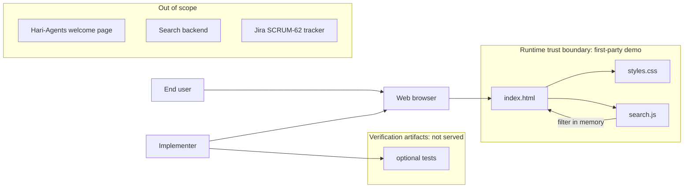
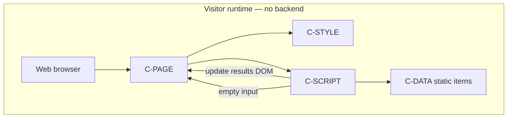
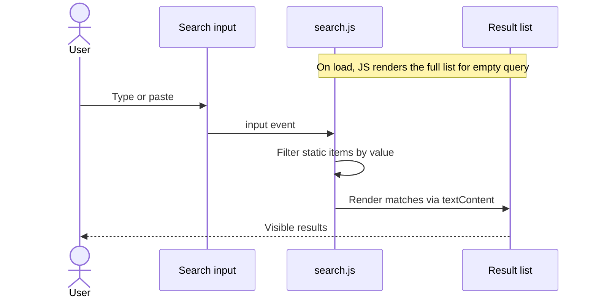
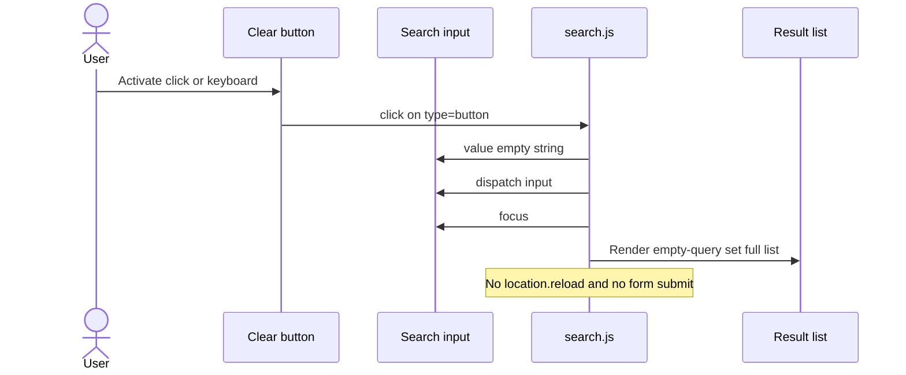

# Architecture: SCRUM-62 — Clear control for search text

## Document status

- Status: Approved
- Design review: Passed (2026-10-06)
- Ready for implementation: Yes
- Recommendation approved: 2026-10-06 (Stage 3 recommendation gate)
- Source requirements: `plans/scrum-62/requirements.md` (Stage 1 approved)
- Jira: [SCRUM-62](https://epam-team-v1cb1mzz.atlassian.net/browse/SCRUM-62)

### Allowed status values

| Status | Meaning |
|--------|---------|
| Proposed | Architecture drafted from approved requirements; awaiting Design Review. |
| Needs Review | Material changes were made and require another Design Review pass. |
| Approved | Design Review passed; implementation planning may begin. |
| Blocked | A finding or missing decision prevents safe progress. |
| Superseded | Replaced by a later architecture document. |

This document records the Stage 3 recommendation plus Design Review corrections (AD-16 through AD-21). Status is **Approved** after the Stage 4 gate (2026-10-06). Ready for implementation: **Yes**. Implementation planning is next; this approval does not start production coding.

---

## 1. Architecture overview

### 1.1 Recommended style

**Client-side search field composition on a static page.** One HTML document, one CSS file, and a small first-party JavaScript module. The browser is the only runtime. There is no application server, SPA framework, or search API.

### 1.2 Why this style fits

Approved FR-1 through FR-5 require a Clear control next to a search box that empties the query without a full page reload and without breaking search. Those behaviors are DOM events.

- A form POST or `location` navigation as the Clear action would fail FR-5.
- CSS-only markup cannot reliably empty an input and keep a named Clear control (FR-1, FR-2).
- Native `type="search"` cancel UI is not a guaranteed product-visible Clear control (A-6).
- No backend is specified. This workspace has no existing search product surface; Hari-Agents welcome page is out of scope (A-9).

A static page with vanilla JS is enough to host a search box, an in-page filter (so FR-4 has a search action to preserve), and a `type="button"` Clear control.

### 1.3 Major system boundaries

| Boundary | Inside | Outside |
|----------|--------|---------|
| Product surface | Search demo: input, Clear, client filter, result list | Hari-Agents welcome copy, SCRUM-61 username form, US-LOGO-1 |
| Query state | The search input value in the page | URL query string, sessionStorage, cookies, server |
| Search behavior | Filter a static in-memory list | Ranking engine, remote search API, query syntax |
| Delivery | Files under `plans/scrum-62/` | Repo-root product, `plans/hari-agents/` page files |
| Runtime | Browser + first-party HTML/CSS/JS | Node.js except optional local tests |

### 1.4 Primary actors and external systems

- **End user** types a query and activates Clear.
- **Implementer** authors files and verifies behavior.
- **Web browser** renders the page and runs first-party JS.
- **No production backend, identity provider, analytics vendor, or Jira-in-page** at runtime.

### 1.5 Important architecture decisions

| ID | Decision | Rationale |
|----|----------|-----------|
| AD-1 | HTML + CSS + vanilla JS; no SPA framework | Clear and in-page search are DOM behavior; a framework adds no FR coverage. |
| AD-2 | `button type="button"` for Clear | Prevents implicit form submit and full reload (FR-5, FR-8). |
| AD-3 | Search input `type="text"`, not `type="search"` | Avoids a second native cancel control (R-4) that would not meet FR-1 by itself (A-6). |
| AD-4 | No search submit navigation; in-page filter only | FR-4 needs an existing search action; FR-5 forbids Clear from reloading. |
| AD-5 | Static in-memory item list as the search corpus | No search API in requirements; gives FR-4 a real filter to keep working. |
| AD-6 | Deliver under `plans/scrum-62/` | Versionable (`plans/` is allowlisted). Do not modify Hari-Agents welcome page (A-9). |
| AD-7 | Clear sets `input.value = ""` and dispatches `input` | One path for live filter; results follow the input (source of truth). |
| AD-8 | No third-party JS, analytics, or remote search | Not required; keeps the trust boundary first-party. |
| AD-9 | Clear stays visible and enabled when the box is empty | Covers AC-1 and AC-3 without hiding the control (Q-2 default). |
| AD-10 | Empty means `value === ""`; spaces are not empty | Q-4 default; matches FR-3 wording. |
| AD-11 | Visible label is the word `Clear` | Q-5 default; accessible name matches visible text. |
| AD-12 | Do not use native search-cancel as the implementation | A-6 / Q-6. |
| AD-13 | Input value is the only query state; results are derived | Q-3 default: Clear is not required to call a separate results API. |
| AD-14 | After Clear, leave focus in the search input | Lets the user type immediately (FR-6); not required by Jira, recommended UX. |
| AD-15 | Optional `node --test` file-text or DOM-free checks later | Verification concern; not a runtime component. |
| AD-16 | Load `search.js` as a classic script (`<script src="search.js">`), not `type="module"` | Classic scripts run on `file://`. ES modules can fail on `file://` and would break Clear and search. |
| AD-17 | Run the filter once on `DOMContentLoaded` (or equivalent) as well as on `input` | Empty-query results must be visible without the user typing first, so FR-4 is observable. |
| AD-18 | Do not wrap the search cluster in a `<form>` | Removes submit/Enter-in-field reload risk (FR-5, FR-8). |
| AD-19 | Use a real `<button>` and listen to `click` only | Browser fires `click` for pointer and for Enter/Space on a focused button (FR-7). No extra `keydown` handler. |
| AD-20 | Render result labels with `textContent` (or equivalent). Never `innerHTML` the query or item strings | Demo corpus is first-party, but this keeps XSS-safe output handling. |
| AD-21 | Empty query (`value === ""`) shows the **full** static list, not a “no results” empty state | Defines the empty-query set used after Clear (AD-13). |

---

## 2. System context

### 2.1 Users and actors

| ID | Actor | Type | Interaction |
|----|-------|------|-------------|
| A-U1 | End user | Human | Types in the search box; activates Clear; reads filtered results. |
| A-U2 | Implementer | Human | Edits HTML/CSS/JS; opens the page in a browser; may run local tests. |
| A-U3 | Assistive technology user | Human | Finds the search input and a control named Clear; uses keyboard. |

### 2.2 Internal systems

| ID | System | Ownership | Notes |
|----|--------|-----------|-------|
| C-PAGE | `index.html` | This delivery | Markup for search cluster, results, no remote assets. |
| C-STYLE | `styles.css` | This delivery | Layout of input + Clear in one cluster; readable contrast. |
| C-SCRIPT | `search.js` | This delivery | Filter + Clear handler; no navigation. |
| C-DATA | Static item list in `search.js` | C-SCRIPT | In-memory corpus; not a database. Not duplicated in HTML. |
| C-TEST | Optional test file | This delivery | Not served to users. |

### 2.3 External systems

None at runtime. Adjacent, non-runtime:

- Jira SCRUM-62 (requirements tracker).
- Hari-Agents welcome page — **not** a dependency and **not** a host.
- Cursor SDLC commands (consume this document).

### 2.4 Input sources and output destinations

| Direction | What | Source / destination |
|-----------|------|----------------------|
| Input | Keystrokes / paste into the search box | User → search input |
| Input | Clear activation (pointer or keyboard) | User → Clear button |
| Input | Static item strings | Source files |
| Output | Input value (query) | Search input DOM |
| Output | Visible result list | DOM list derived from query |
| Output | Painted UI | Browser viewport |

No persistence. No outbound application traffic.

### 2.5 Trust and ownership boundaries

- **Runtime trust boundary:** first-party `index.html`, `styles.css`, and `search.js` only.
- **No secrets**, cookies, or tokens.
- **Ownership:** SCRUM-62 demo and SDLC docs in `plans/scrum-62/`. Hari-Agents files stay unchanged.
- **Clear must not** load a new document URL as its action.

### 2.6 Context diagram

Jira is a planning system, not a runtime integration.

---

## 3. Architecture principles

1. **Clear is a non-navigating command.** It mutates the input value only; it never submits a form or reloads the document.
2. **One query state.** The input value is canonical. Results are a pure function of that value plus the static list.
3. **Search remains a separate action.** Filtering on `input` events continues to work after Clear is added (FR-4).
4. **Accessible name is Clear.** Visible text `Clear` (AD-11); the control is a real `button`.
5. **Empty Clear is idempotent.** No error UI, no reload, value stays `""`.
6. **Do not expand scope.** No backend, URL sync, autocomplete, history, or Hari-Agents copy changes.

---

## 4. Components and responsibilities

### 4.1 Component catalog

| ID | Component | Responsibility | Does not do |
|----|-----------|----------------|-------------|
| C-PAGE | `index.html` | Landmark for the search cluster; search input (`type="text"`) with a visible `<label>` associated via `for`/`id`; Clear `button type="button"` with visible text `Clear`; results container; same-folder CSS; classic `script src="search.js"` (AD-16); no `<form>` (AD-18); no remote `src`/`href`. | Page reload, form POST, Hari-Agents copy, inline result HTML |
| C-STYLE | `styles.css` | Place Clear inside or immediately next to the input (same cluster); keep both usable; readable contrast. | Business logic |
| C-SCRIPT | `search.js` | Own C-DATA; filter on load (AD-17) and on `input`; on Clear `click` (AD-19), set value to `""`, dispatch `input`, restore focus; if already empty, still run with no error; render with `textContent` (AD-20); empty query shows full list (AD-21). | `location.reload`, `form.submit`, fetch, `type="module"` |
| C-DATA | Static list in `search.js` | Provide a small fixed set of first-party strings so search is observable. | Persistence, ranking, HTML duplication |
| C-BROWSER | Web browser | Render and run first-party JS. Not authored. | — |

### 4.2 Component diagram

### 4.3 Data ownership

| Data | Owner | Persistence | Notes |
|------|-------|-------------|-------|
| Query string | Search input (`value`) | None (session DOM only) | Canonical query. |
| Result set | Derived by C-SCRIPT | None | Filter of C-DATA by query. |
| Item corpus | C-SCRIPT (`search.js`) | Source files | Fixed demo strings; single owner. |
| Clear enabled/visible | Always both (AD-9) | N/A | Independent of query length. |

No write-back, no cache coherence.

### 4.4 Integration points

None. HTML loads same-folder CSS and JS. No HTTP APIs, webhooks, or environment variables.

---

## 5. Data flows

### 5.1 Type-to-filter (existing search)

### 5.2 Clear with non-empty text (FR-2, FR-5)

### 5.3 Clear when already empty (FR-3)

Same handler. Value remains `""`. No error node. No reload. Results stay the full list (AD-21).

Clear during IME composition is not specified in Jira. Setting `value` to `""` ends composition; no extra IME handler is required.

---

## 6. Technology choices and alternatives

### 6.1 Chosen stack

| Concern | Choice | Why |
|---------|--------|-----|
| Markup | HTML5 | FR-1 maps to input + button. |
| Presentation | CSS3 | Cluster layout. |
| Behavior | Vanilla JS, one file | FR-2, FR-5; no bundler. |
| Input type | `text` | AD-3. |
| Button type | `button` | AD-2. |
| Search algorithm | Case-insensitive substring | Enough to prove FR-4; not a product ranker. |
| Script loading | Classic `<script src="search.js">` | AD-16; `file://` compatible. |
| Hosting | `file://` or optional static server | No backend. |
| Tests | Optional `node --test` later | Workspace has no required test framework for this story. |

### 6.2 Alternatives considered

| Alternative | Verdict | Reason |
|-------------|---------|--------|
| Native `type="search"` only | Rejected | A-6; inconsistent Clear UI; may not expose name Clear. |
| Form GET/POST | Rejected | Reloads; fails FR-5 if Clear is submit. |
| React/Vue SPA | Rejected | No FR needs a framework. |
| Remote search API | Rejected | Out of scope. |
| Patch Hari-Agents welcome page | Rejected | A-9; that page forbids search. |
| Hide Clear when empty | Deferred | Would risk AC-1; AD-9 chooses always visible. |
| URL `?q=` sync | Out of scope | Would need `replaceState`, not reload; not in FR. |
| ES module `type="module"` | Rejected | Can fail on `file://` (AD-16). |

---

## 7. Security boundaries

- First-party files only. Render items with `textContent` (AD-20). Do not interpolate the query into HTML.
- Query is not sent anywhere. No personal data is collected.
- AuthN/AuthZ are not applicable (no accounts, no API).
- No secrets, cookies, or tokens.
- Clear must not be an `<a href>` to the same page (that reloads).
- No CSP third-party exceptions are required if no remote scripts are added.
- Audit logging is not required (no production service).

---

## 8. Reliability and scalability

- Corpus is a handful of static strings; filter is O(n) in-memory and is not a scale target.
- Clear is idempotent on empty value.
- If JS fails to load, search filter and Clear will not work; that is an accepted static-page risk. Markup still shows the input and Clear button (visible but inert). Do not claim search works without JS.
- There is no retry, timeout, or duplicate-submit problem: Clear has no network side effect and is idempotent.
- No multi-region, queue, or cache design is required.

---

## 9. Observability and operations

- No production logging, metrics, or error reporting stack is in requirements.
- Verification is visual plus optional tests: Clear present; empty on click; empty click no error; filter still works; no full reload.
- Operational ownership: implementer of `plans/scrum-62/`. No on-call service.

---

## 10. Mapping to functional requirements

| FR | How the architecture covers it |
|----|--------------------------------|
| FR-1 | C-PAGE Clear button in the same cluster as the input; accessible name Clear. |
| FR-2 | C-SCRIPT sets value to `""`. |
| FR-3 | Same handler; no error UI; value stays `""`. |
| FR-4 | C-SCRIPT filter on load (AD-17) and `input`; Clear reuses that path via dispatched `input`. |
| FR-5 | `type="button"`; no `<form>` (AD-18); no `location` change. |
| FR-6 | Input remains; AD-14 restores focus. |
| FR-7 | Real `button`; native `click` includes keyboard (AD-19). |
| FR-8 | No form submit; Clear is not `type="submit"` (AD-18). |

---

## 11. Open decisions carried forward

These were defaults in the approved recommendation. Changing them requires architecture rework:

- Host is this workspace demo, not another product repo (Q-1).
- Clear always visible/enabled (Q-2).
- Results follow input; no separate reset API (Q-3).
- Spaces are not empty (Q-4).
- Visible word `Clear` (Q-5).
- Custom button, not native cancel (Q-6).

---

## 12. Out of scope (architecture)

Search backend, ranking, autocomplete, saved searches, URL query sync, SCRUM-61, Hari-Agents welcome page changes, logo/PWA, analytics.

---

## 13. Design Review (2026-10-06)

Review status: **Ready with conditions** (conditions are AD-16–AD-21, now recorded). No Critical or High findings remain.

| ID | Severity | Disposition |
|----|----------|-------------|
| DR-1 | Medium | Fixed: C-DATA owned solely by `search.js`. |
| DR-2 | Medium | Fixed: classic script for `file://` (AD-16). |
| DR-3 | Medium | Fixed: initial filter on load (AD-17); empty query shows full list (AD-21). |
| DR-4 | Medium | Fixed: no `<form>` (AD-18). |
| DR-5 | Low | Fixed: `click` on a real button covers keyboard (AD-19). |
| DR-6 | Low | Fixed: `textContent` only (AD-20); labeled search input. |
| DR-7 | Low | Accepted: IME composition needs no extra handler. |
| DR-8 | Low | Fixed: optional tests shown as not-served in the context diagram. |

Conditions for later implementation (not architecture blockers): optional tests remain optional; visual contrast is “readable,” not a numeric brand palette.
