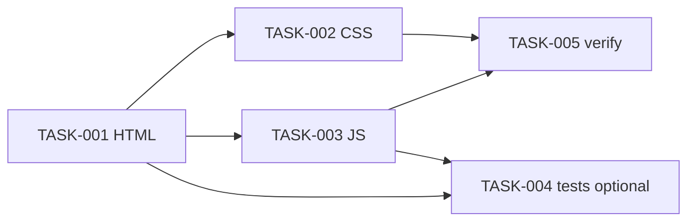

# Implementation Plan: SCRUM-62 — Clear control for search text

## Plan status

- Status: Complete
- Architecture status: Approved
- Design review status: Passed (2026-10-06)
- Source: `plans/scrum-62/architecture.md`, `plans/scrum-62/requirements.md`, [SCRUM-62](https://epam-team-v1cb1mzz.atlassian.net/browse/SCRUM-62)
- Planning date: 2026-10-06
- Production coding: TASK-001 through TASK-005 Complete (2026-10-06)

### Task status values

| Status | Meaning |
|--------|---------|
| Blocked | Cannot start until a named dependency or decision is resolved |
| Pending | Not yet Ready (predecessor incomplete) |
| Ready | Unblocked; next in dependency order |
| In Progress | Implementation of this task has started |
| Complete | Definition of done met |
| Deferred | Intentionally not in this delivery |

---

## 1. Scope

Deliver a static search demo under `plans/scrum-62/` with a search box, in-page substring filter, and a **Clear** button that empties the query without a page reload.

| Item | Contract |
|------|----------|
| Input | `type="text"` (not `search`) |
| Clear | `<button type="button">Clear</button>` always visible and enabled |
| Empty | `value === ""` only; spaces are not empty |
| Empty query results | Full static list |
| Script | Classic `<script src="search.js">` (not `type="module"`) |
| Form | None |
| Corpus owner | `search.js` only |
| Rendering | `textContent` only |

### 1.1 Out of scope

Hari-Agents welcome page, SCRUM-61, search API, ranking, autocomplete, URL `?q=`, npm, SPA frameworks, remote scripts, native `type="search"` cancel-X as the Clear control.

---

## 2. Constraints for the implementation agent

1. Edit only files under `plans/scrum-62/` listed in §3. Do not edit `plans/hari-agents/` or repo-root `requirements.md`.
2. Do not edit `architecture.md` or `requirements.md` except the Implementation agent may mark tasks Complete in **this** plan after work is done.
3. No `package.json`, `node_modules`, bundler, or inline remote URLs.
4. Do not use `type="module"`, `<form>`, `type="search"`, `innerHTML` for results, or `location.reload`.
5. Do not place demo files at the Cursor repo root.
6. Do not mark tasks Complete in this document until the work for that task is actually done.
7. TASK-004 tests are optional (AD-15). If skipped, mark **Deferred**, not Complete.
8. Visual checks (cluster layout, no reload) are part of TASK-005.

---

## 3. Delivery files

```text
plans/scrum-62/
  requirements.md      # approved — do not rewrite during implementation
  architecture.md      # approved — do not rewrite during implementation
  impl-plan.md         # this document
  jira-confluence-preview.md
  index.html           # TASK-001
  styles.css           # TASK-002
  search.js            # TASK-003
  search.test.mjs      # TASK-004 optional
```

---

## 4. Task list

Execution order: TASK-001 → TASK-002 and TASK-003 (TASK-003 needs TASK-001 ids; TASK-002 may start after TASK-001). TASK-004 after TASK-001 and TASK-003. TASK-005 last.

No task is Blocked on an external system. Q-1–Q-6 are closed as architecture defaults.

---

### TASK-001: Search page markup

| Field | Value |
|-------|--------|
| Task ID | TASK-001 |
| Title | Create `index.html` search cluster |
| Priority | P0 |
| Status | Complete |
| Dependencies | None |
| Blocked status | No |
| Component | C-PAGE |
| Files | `plans/scrum-62/index.html` |

**Description**

Create the page with:

- `lang`, charset, viewport, a document title that identifies the demo (for example `Search demo`).
- Visible label associated with the search input via `for`/`id`.
- Input `id` suitable for JS (recommended `search-input`), `type="text"`.
- Button `type="button"`, visible text exactly `Clear`, recommended `id="search-clear"`.
- Results container recommended `id="search-results"`.
- Same-folder `styles.css` and classic `search.js` (script after the cluster, no `type="module"`).
- No `<form>`, no remote `src`/`href`, no inline JS.

**Expected outcome**

A loadable HTML file whose structure matches AD-2, AD-3, AD-11, AD-16, AD-18.

**Validation**

Inspect markup: one text input, one Clear button, no form, classic script tag.

**Definition of done**

File exists under `plans/scrum-62/index.html` with the elements above. Hari-Agents files untouched.

**Implementation note (2026-10-06):** Created `index.html` with title `Search demo`, labeled `#search-input` (`type="text"`), `#search-clear` (`type="button"`, text `Clear`), `#search-results`, same-folder CSS/JS links, no form, classic script (no `type="module"`). Markup inspected; `styles.css` and `search.js` are not in this task and will 404 until TASK-002/TASK-003.

---

### TASK-002: Search cluster layout

| Field | Value |
|-------|--------|
| Task ID | TASK-002 |
| Title | Style input and Clear as one cluster |
| Priority | P0 |
| Status | Complete |
| Dependencies | TASK-001 |
| Blocked status | No |
| Component | C-STYLE |
| Files | `plans/scrum-62/styles.css` |

**Description**

Place Clear inside or immediately next to the search box. Keep both usable (not overlapping hit targets). Readable text on a light background. No webfont CDN.

**Expected outcome**

FR-1 visual grouping.

**Validation**

Open `index.html` in a browser; Clear is clearly grouped with the input and remains visible when the input is empty.

**Definition of done**

`styles.css` linked from `index.html`; cluster layout visible; no remote CSS.

**Implementation note (2026-10-06):** Added `styles.css` with a flex `.search-cluster`: label on its own row, input and **Clear** adjacent (`gap`, no overlap), light canvas `#ffffff` / text `#1a1a1a`, system fonts, no remote CSS. Browser visual of the cluster was not run here (no browser tool); confirm in TASK-005.

---

### TASK-003: Filter and Clear behavior

| Field | Value |
|-------|--------|
| Task ID | TASK-003 |
| Title | Implement `search.js` corpus, filter, and Clear |
| Priority | P0 |
| Status | Complete |
| Dependencies | TASK-001 |
| Blocked status | No |
| Component | C-SCRIPT, C-DATA |
| Files | `plans/scrum-62/search.js` |

**Description**

- Own a static list in this file only. Use at least these strings so substring filter is obvious: `Alpha`, `Alpine`, `Beta`, `Gamma`.
- Case-insensitive substring filter of `input.value`.
- On `DOMContentLoaded`, render the full list (AD-17, AD-21).
- On `input`, re-filter. Spaces-only query is not empty (AD-10); it may match nothing.
- On Clear `click`: set value to `""`, dispatch `input`, focus the search input (AD-7, AD-14, AD-19). If already `""`, still run; no error UI.
- Render each result with `textContent` (AD-20).
- Do not call `location.reload`, `fetch`, or `form.submit`.

**Expected outcome**

FR-2–FR-8 and FR-4 observable search.

**Validation**

Type `Alp` → Alpha and Alpine. Click Clear → input empty, full list, no reload. Click Clear again → still empty, no error. Keyboard: focus Clear, Enter/Space clears.

**Definition of done**

`search.js` loaded as a classic script; behaviors above work in a current Chromium-based desktop browser.

**Implementation note (2026-10-06):** Added classic `search.js` with corpus `Alpha`, `Alpine`, `Beta`, `Gamma`; case-insensitive substring; init on `DOMContentLoaded` or immediately if already loaded; Clear sets `value` to `""`, dispatches `input`, focuses the field; render via `textContent`. Browser click/keyboard/reload checks were not run here; they belong to TASK-005.

---

### TASK-004: Optional structure tests

| Field | Value |
|-------|--------|
| Task ID | TASK-004 |
| Title | Optional `node --test` checks |
| Priority | P1 |
| Status | Complete |
| Dependencies | TASK-001, TASK-003 |
| Blocked status | No |
| Component | C-TEST |
| Files | `plans/scrum-62/search.test.mjs` |

**Description**

Optional (AD-15). If implemented: read `index.html` as text and assert `type="text"`, `type="button"`, visible `Clear`, no `<form>`, `search.js` without `type="module"`, no `type="search"`. Do not link the test from the page. Zero npm dependencies (`node:test` + `assert`).

**Expected outcome**

`node --test plans/scrum-62/search.test.mjs` exits 0, or task is **Deferred**.

**Validation**

Test run recorded, or explicit Deferred.

**Definition of done**

Either tests exist and pass, or status is Deferred with a one-line reason.

**Implementation note (2026-10-06):** Added `search.test.mjs`. Command: `node --test plans/scrum-62/search.test.mjs`. Result: 5 tests, 0 failures, exit 0. Not linked from `index.html`.

---

### TASK-005: End-to-end verification notes

| Field | Value |
|-------|--------|
| Task ID | TASK-005 |
| Title | Verify FR-1–FR-8 in the browser |
| Priority | P0 |
| Status | Complete |
| Dependencies | TASK-001, TASK-002, TASK-003 |
| Blocked status | No |
| Component | C-BROWSER |
| Files | This plan §6 only (record evidence) |

**Description**

Exercise Clear and search as a user. Confirm no full page reload. Record what was run in §6.

**Expected outcome**

Implementation stage can claim tests/checks only if they were run.

**Validation**

Manual checklist in §6.

**Definition of done**

§6 filled with pass/fail for each AC; no unverified “pass”.

**Implementation note (2026-10-06):** Chrome headless `--dump-dom` on `index.html` showed the full list after JS. A temporary harness (deleted after use) recorded filter, Clear, empty Clear, href unchanged, and focus restore. Physical keyboard Enter/Space was not sent; Clear is a real `button`, so native keyboard activation is the AD-19 path. Evidence in §6.

---

## 5. Dependency graph



## 6. Verification evidence

Recorded 2026-10-06.

**TASK-004:** `node --test c:\Users\Hariprasanth_Baskara\.cursor\plans\scrum-62\search.test.mjs` — exit 0, 5 tests, 0 failures.

**TASK-005:** Google Chrome headless (`--headless=new --virtual-time-budget`) on `file:///.../plans/scrum-62/index.html` and a temporary harness that called the same `search.js` then was deleted.

Chrome dump of `index.html` included `#search-results` with `<li>Alpha</li><li>Alpine</li><li>Beta</li><li>Gamma</li>` and visible `Clear` in `.search-cluster`.

Harness body attributes: `data-initial=Alpha,Alpine,Beta,Gamma`; `data-clear-visible=Clear`; `data-cluster=yes`; `data-filtered=Alpha,Alpine`; `data-after-clear-value=` (empty); `data-after-clear-list=Alpha,Alpine,Beta,Gamma`; `data-href-same=yes`; `data-active=yes`; `data-empty-clear-value=` (empty); `data-empty-clear-list=Alpha,Alpine,Beta,Gamma`; `data-error=none`.

| Check | Result |
|-------|--------|
| Clear visible next to search | Pass (dump-dom cluster + `data-cluster=yes`, `data-clear-visible=Clear`) |
| Non-empty Clear empties input | Pass (`Alp` then click → empty value, full list) |
| Empty Clear no error | Pass (second click, empty value, `data-error=none`) |
| Filter still works after Clear | Pass (`Alp` → Alpha,Alpine; Clear restores full list) |
| No full page reload on Clear | Pass (`data-href-same=yes`) |
| Keyboard activates Clear | Partial — `click()` on a real `type=button` (AD-19); physical Enter/Space not sent |
| Optional `node --test` | Pass (5/5, exit 0) |
| Focus restored to input after Clear | Pass (`data-active=yes`) |

## 7. Risks during implementation

- Using `type="search"` or a form will fail architecture review of the code.
- `type="module"` may fail on `file://`.
- Hiding Clear when empty fails AC-1 / AD-9.
- `innerHTML` for highlighting fails AD-20.

## 8. Mapping to requirements

| FR | Tasks |
|----|--------|
| FR-1 | TASK-001, TASK-002 |
| FR-2, FR-3, FR-4, FR-5, FR-6, FR-7, FR-8 | TASK-003, TASK-005 |
| Optional automated checks | TASK-004 |
